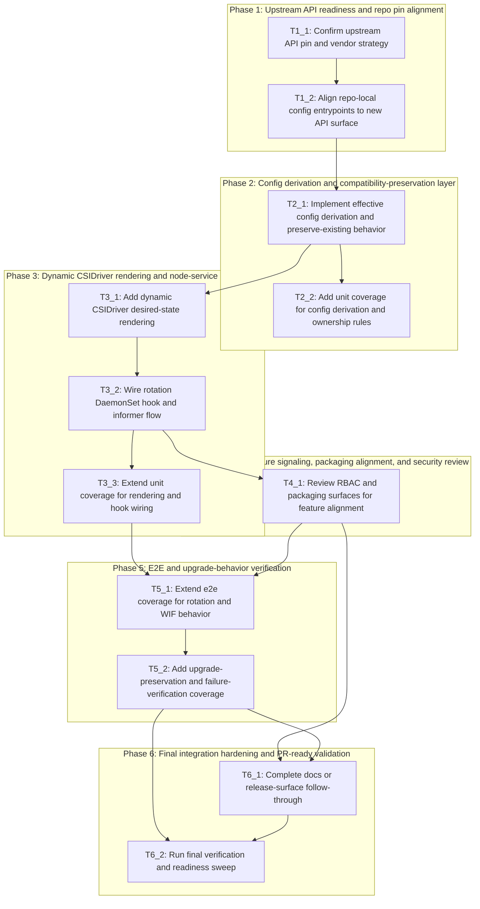

# Execution Backlog
**Feature:** Configurable Secret Rotation and Workload Identity Federation
**AgentRoutingMode:** PROVIDED
**ConstitutionVersion:** 1.0.0

## 0. Input coverage checklist
- `FR-001`, `FR-002`, `SC-001`, `SC-002`, User Story 1, Plan Phase 2, and Plan Phase 3 are covered by `T2_1`, `T2_2`, `T3_1`, `T3_2`, and `T3_3`.
- `FR-003`, `FR-009`, `FR-010`, `SC-003`, `SC-005`, User Story 2, and User Story 4 are covered by `T1_1`, `T2_1`, `T2_2`, `T3_1`, `T3_3`, `T5_1`, and `T5_2`.
- `FR-004`, `FR-005`, `FR-006`, `SC-004`, User Story 3, the upgrade edge cases, and Plan Phase 5 are covered by `T2_1`, `T2_2`, `T3_1`, `T5_1`, `T5_2`, and `T6_2`.
- `FR-007`, `FR-008`, `SC-006`, invalid-config edge cases, and Plan Phase 4 are covered by `T2_1`, `T3_1`, `T4_1`, `T5_2`, and `T6_2`.
- Plan Phase 1 is covered by `T1_1` and `T1_2`; Plan Phase 6 is covered by `T6_1` and `T6_2`.
- Validation follow-ups on default-interval clarity, documentation scope, and upgrade-proof evidence are covered by `T5_2`, `T6_1`, and `T6_2`.

## 1. Task Dependency Graph (Mermaid)

## 2. Linear Execution Order (Chronological)
1. [x] T1_1 — Confirm upstream API pin and vendor strategy
2. [x] T1_2 — Align repo-local config entrypoints to new API surface
3. [x] T2_1 — Implement effective config derivation and preserve-existing behavior
4. T2_2 — Add unit coverage for config derivation and ownership rules
5. T3_1 — Add dynamic CSIDriver desired-state rendering
6. T3_2 — Wire rotation DaemonSet hook and informer flow
7. T3_3 — Extend unit coverage for rendering and hook wiring
8. T4_1 — Review RBAC and packaging surfaces for feature alignment
9. T5_1 — Extend e2e coverage for rotation and WIF behavior
10. T5_2 — Add upgrade-preservation and failure-verification coverage
11. T6_1 — Complete docs or release-surface follow-through
12. T6_2 — Run final verification and readiness sweep

## 3. Task Execution Manifest (table)
| Task ID | Task Title | Assigned Agent | Phase | Depends On | Parallel OK | Complexity | Risk |
|---------|-----------|---------------|-------|-----------|------------|-----------|------|
| T1_1 | Confirm upstream API pin and vendor strategy | DependencyVendoring | Phase 1 | none | No | 3 | Med |
| T1_2 | Align repo-local config entrypoints to new API surface | OperatorController | Phase 1 | T1_1 | No | 3 | Med |
| T2_1 | Implement effective config derivation and preserve-existing behavior | OperatorController | Phase 2 | T1_2 | No | 5 | High |
| T2_2 | Add unit coverage for config derivation and ownership rules | Testing | Phase 2 | T2_1 | No | 3 | Med |
| T3_1 | Add dynamic CSIDriver desired-state rendering | AssetManifests | Phase 3 | T2_1 | No | 5 | High |
| T3_2 | Wire rotation DaemonSet hook and informer flow | OperatorController | Phase 3 | T3_1 | No | 5 | High |
| T3_3 | Extend unit coverage for rendering and hook wiring | Testing | Phase 3 | T3_2 | No | 3 | Med |
| T4_1 | Review RBAC and packaging surfaces for feature alignment | RBACSecurity | Phase 4 | T3_2 | Yes | 2 | Med |
| T5_1 | Extend e2e coverage for rotation and WIF behavior | Testing | Phase 5 | T3_3, T4_1 | No | 5 | High |
| T5_2 | Add upgrade-preservation and failure-verification coverage | Testing | Phase 5 | T5_1 | No | 3 | High |
| T6_1 | Complete docs or release-surface follow-through | Docs | Phase 6 | T5_2, T4_1 | Yes | 2 | Low |
| T6_2 | Run final verification and readiness sweep | Testing | Phase 6 | T5_2, T6_1 | No | 3 | Med |

## 4. Task Specifications (Payloads)

### Task T1_1: Confirm upstream API pin and vendor strategy
- **Objective:** Identify the exact vendorable upstream `openshift/api` version or commit that carries the Secrets Store driver configuration surface, and prepare the repo dependency path for that update.
- **Target file(s):** `go.mod`, `vendor/`, `pkg/operator/starter.go`
- **Non-goals / forbidden edits:** Do not introduce a new CRD, `api/` package, controller-runtime dependency, or manual edits under `vendor/`.
- **Implementation notes:** Respect the constitution’s “No Custom CRD Types” and vendoring rules. Treat this as a dependency and compile-readiness task first, not as feature implementation. If the upstream API pin is still unresolved, stop here and surface the blocker rather than guessing local type names.
- **Acceptance criteria:** The backlog owner can point to a concrete upstream API version/commit for the new Secrets Store config surface, `go.mod`/vendor update strategy is explicit, and downstream tasks know whether repo-local code can reference the new fields. This task covers `FR-003`, `FR-004`, `FR-005`, `FR-009`, and plan Phase 1.
- **Downstream handoff:** A confirmed vendoring target and a repo-local understanding of what `ClusterCSIDriver` fields/symbols are safe to reference in `pkg/operator/`.

### Task T1_2: Align repo-local config entrypoints to new API surface
- **Objective:** Update repo-local entrypoints and config-reading assumptions so `pkg/operator/` is ready to consume the new Secrets Store-specific config once vendored.
- **Target file(s):** `pkg/operator/starter.go`, `go.mod`
- **Non-goals / forbidden edits:** Do not implement dynamic CSIDriver rendering or DaemonSet behavior changes yet; do not bypass `getOperatorSyncState()`.
- **Implementation notes:** Focus on import/use adaptation and any necessary repo-local plumbing boundaries. Keep the single `CSIControllerSet` architecture intact and avoid speculative helper behavior until the API surface is verified.
- **Acceptance criteria:** Repo-local operator wiring can compile against the updated API surface without invented type aliases or shadow config models, and no new controller loop is introduced. This task supports `FR-001` through `FR-010` by unblocking actual implementation.
- **Downstream handoff:** A stable repo-local contract for later helper logic and controller wiring tasks to consume.

### Task T2_1: Implement effective config derivation and preserve-existing behavior
- **Objective:** Add repo-local helper logic that derives the effective rotation and token-request behavior from `ClusterCSIDriver`, including managed/unmanaged ownership semantics and preservation of existing live token requests.
- **Target file(s):** `pkg/operator/secrets_store_config.go`, `pkg/operator/starter.go`
- **Non-goals / forbidden edits:** Do not write production behavior directly into packaging files or sample manifests; do not invent new persistence objects or a new controller framework.
- **Implementation notes:** This task should centralize defaulting, disablement, custom interval derivation, multi-audience handling, empty managed audience clearing, and preserve-existing behavior on upgrade. Treat the omitted-field default behavior carefully so future tests can distinguish contract vs implementation detail.
- **Acceptance criteria:** Repo-local helpers can express the behavior needed for `FR-001` through `FR-010`, especially `FR-004`, `FR-005`, `FR-006`, and `FR-010`, without violating constitution guardrails. The logic is ready to feed both CSIDriver rendering and DaemonSet arg mutation.
- **Downstream handoff:** Reusable helper functions and decision points that `T2_2`, `T3_1`, and `T3_2` can consume without redefining semantics.

### Task T2_2: Add unit coverage for config derivation and ownership rules
- **Objective:** Add table-driven unit tests that lock down the config-derivation and token-request ownership behavior before runtime wiring expands.
- **Target file(s):** `pkg/operator/secrets_store_config_test.go`, `pkg/operator/starter_test.go`
- **Non-goals / forbidden edits:** Do not rely on cluster-backed tests for logic that can be proven with unit tests; do not introduce third-party assertion or mocking libraries.
- **Implementation notes:** Follow `docs/testing-guidelines.md`: named table-driven cases, `t.Run`, `v1helpers.NewFakeOperatorClientWithObjectMeta(...)`, standard library assertions. Cover omitted/default rotation, disabled rotation, custom intervals, managed/unmanaged behavior, empty managed audiences, and preservation of existing live token requests.
- **Acceptance criteria:** `make verify` and `make test-unit` can exercise deterministic unit coverage for the new config logic, directly supporting `SC-001`, `SC-002`, `SC-004`, `SC-005`, and `SC-006`.
- **Downstream handoff:** A regression net for controller/asset tasks so later behavior changes break tests instead of drifting silently.

### Task T3_1: Add dynamic CSIDriver desired-state rendering
- **Objective:** Replace the current static `CSIDriver` behavior with a dynamically rendered desired object that can set `requiresRepublish` and `tokenRequests` from effective config while preserving existing live behavior when needed.
- **Target file(s):** `pkg/operator/starter.go`, `assets/csidriver.yaml`, `assets/assets.go`
- **Non-goals / forbidden edits:** Do not replace `WithConditionalStaticResourcesController` with a new reconciliation pattern; do not move implementation into `config/manifests/stable/`.
- **Implementation notes:** Keep `assets/csidriver.yaml` as the embedded base manifest and overlay runtime-derived fields through repo-local code. Respect management-state gating and treat delete/recreate behavior as an expected operational characteristic that later verification must prove safe.
- **Acceptance criteria:** The desired `CSIDriver` state can represent default rotation, disabled rotation, custom intervals, managed audiences, cleared audiences, and preserved live audiences, covering `FR-001`, `FR-003`, `FR-004`, `FR-005`, `FR-006`, `FR-009`, and `FR-010`.
- **Downstream handoff:** A dynamic desired-state path ready for hook wiring and integrated tests, with the base asset still embedded and namespace-safe.

### Task T3_2: Wire rotation DaemonSet hook and informer flow
- **Objective:** Add the rotation-specific DaemonSet hook and any necessary informer/lister plumbing so the node-service reconciliation path reflects administrator-selected rotation behavior.
- **Target file(s):** `pkg/operator/starter.go`, `assets/node.yaml`
- **Non-goals / forbidden edits:** Do not remove or bypass `WithCABundleDaemonSetHook(...)`; do not convert the DaemonSet to a static-resource-managed object.
- **Implementation notes:** Chain the new hook with the existing CA bundle hook, keep informer scope minimal, and preserve upgrade-safe defaults when the administrator omits new config. `assets/node.yaml` remains the seed manifest even if the effective args are hook-owned at runtime.
- **Acceptance criteria:** The node DaemonSet can reflect enabled/disabled/custom rotation behavior without violating the constitutional single-controller-set model or CA bundle propagation requirement, directly supporting `FR-001`, `FR-002`, `FR-006`, and `SC-001`/`SC-002`.
- **Downstream handoff:** Stable runtime wiring and arg-mutation behavior for `T3_3`, `T4_1`, and `T5_1` to validate.

### Task T3_3: Extend unit coverage for rendering and hook wiring
- **Objective:** Add focused unit tests for the dynamic CSIDriver rendering path and the rotation DaemonSet hook/wiring path.
- **Target file(s):** `pkg/operator/secrets_store_config_test.go`, `pkg/operator/starter_test.go`
- **Non-goals / forbidden edits:** Do not defer deterministic rendering/hook tests to e2e; do not add tests that duplicate library-go internals instead of repo-local behavior.
- **Implementation notes:** Validate rendered `CSIDriver` fields, preservation-vs-managed behavior, and DaemonSet arg replacement semantics. Include negative-path checks where the runtime should surface failure rather than partially applying behavior.
- **Acceptance criteria:** Repo-local unit coverage exists for the new CSIDriver rendering and node-service hook logic, reducing risk before cluster-backed e2e starts. This task supports `SC-003`, `SC-004`, `SC-005`, and `SC-006`.
- **Downstream handoff:** Verified runtime building blocks and clearer failure signatures for e2e design.

### Task T4_1: Review RBAC and packaging surfaces for feature alignment
- **Objective:** Confirm whether the implemented runtime behavior requires RBAC or OLM packaging follow-through, and adjust only the necessary asset-driven or packaging-driven surfaces.
- **Target file(s):** `assets/rbac/secretproviderclasses_role.yaml`, `config/manifests/stable/secrets-store-csi-driver-operator.clusterserviceversion.yaml`, `config/manifests/stable/image-references`, `README.md`
- **Non-goals / forbidden edits:** Do not start runtime implementation in CSV/sample manifests; do not broaden privileges unless the implementation proves a real gap.
- **Implementation notes:** Treat this as a least-privilege and packaging-alignment review first. The current evidence suggests existing token-minting and `csidrivers` permissions may already be sufficient; only change them if runtime behavior demonstrably requires it.
- **Acceptance criteria:** Any required RBAC or packaging delta is explicit, minimal, and aligned with runtime behavior; if no delta is needed, that decision is documented and verified. This task supports `FR-007`, `FR-008`, and the constitution’s RBAC/OLM rules.
- **Downstream handoff:** Confirmed security/packaging baseline for e2e and release-facing readiness tasks.

### Task T5_1: Extend e2e coverage for rotation and WIF behavior
- **Objective:** Expand cluster-backed e2e coverage to validate administrator-visible rotation and WIF behavior across the main supported operating modes.
- **Target file(s):** `hack/e2e.sh`
- **Non-goals / forbidden edits:** Do not replace the repo’s bash e2e harness with a new framework; do not skip teardown or diagnostic dump behavior.
- **Implementation notes:** Cover default rotation, disabled rotation, custom interval behavior, managed audiences, cleared managed audiences, and multiple audiences. Reuse the existing cluster setup/SecretProviderClass/pod-mount flow where possible instead of inventing a disconnected test harness.
- **Acceptance criteria:** `make test-e2e` can exercise cluster-visible behavior corresponding to `SC-001`, `SC-002`, `SC-003`, and `SC-005`, and the script remains aligned with existing teardown/diagnostic patterns.
- **Downstream handoff:** Cluster-backed verification scenarios that can be reused for upgrade/preservation checks and PR readiness.

### Task T5_2: Add upgrade-preservation and failure-verification coverage
- **Objective:** Add targeted verification for the feature’s highest-risk behaviors: preserved live token requests on upgrade, safe operator-managed ownership transitions, and clear handling of invalid configuration/failure paths.
- **Target file(s):** `hack/e2e.sh`, `pkg/operator/secrets_store_config_test.go`, `pkg/operator/starter_test.go`
- **Non-goals / forbidden edits:** Do not introduce a bespoke migration controller or workaround unless evidence proves the current runtime pattern is insufficient.
- **Implementation notes:** This task addresses the biggest residual concerns from validation and planning: upgrade-proof evidence for CSIDriver recreate behavior and visible failure handling when configuration is invalid or cannot be applied cleanly.
- **Acceptance criteria:** Verification exists for `SC-004` and `SC-006`, including preserved pre-existing token request behavior on upgrade and observable failure/degraded handling instead of silent drift.
- **Downstream handoff:** High-risk behaviors are verified well enough for final readiness and any follow-on docs/release notes.

### Task T6_1: Complete docs or release-surface follow-through
- **Objective:** Close any explicitly confirmed documentation or release-surface follow-through needed by the implementation, especially around refresh-interval guidance or ownership semantics.
- **Target file(s):** `README.md`, `config/manifests/stable/secrets-store-csi-driver-operator.clusterserviceversion.yaml`, `config/manifests/stable/image-references`
- **Non-goals / forbidden edits:** Do not silently expand documentation scope beyond what the product/SME decision allows; do not hand-edit version metadata that should go through `hack/update-metadata.sh`.
- **Implementation notes:** Only perform this task if runtime behavior or product expectations require documentation/release-facing updates. Keep it narrowly scoped to the validated feature behaviors and operator-admin guidance.
- **Acceptance criteria:** Any required admin-facing explanation or packaging-facing release follow-through is complete and consistent with the implemented behavior; otherwise, the task documents that no follow-up was required.
- **Downstream handoff:** Final human-facing surfaces are aligned with the implementation for readiness review.

### Task T6_2: Run final verification and readiness sweep
- **Objective:** Perform the final repo-standard readiness sweep that proves the complete feature work respects constitutional rules, repo guardrails, and approved behaviors.
- **Target file(s):** `pkg/operator/starter.go`, `pkg/operator/secrets_store_config.go`, `pkg/operator/secrets_store_config_test.go`, `pkg/operator/starter_test.go`, `assets/csidriver.yaml`, `assets/node.yaml`, `hack/e2e.sh`, and any packaging/doc files touched by the implementation
- **Non-goals / forbidden edits:** Do not add new feature scope here; do not waive `make check` or retroactively soften verification requirements.
- **Implementation notes:** This is the convergence task: confirm `make check`, run cluster-backed verification when available, and manually inspect management-state gating, CA bundle hook preservation, effective DaemonSet args, and effective `CSIDriver` behavior.
- **Acceptance criteria:** Repo-standard preflight passes, cluster-backed verification is complete when environment is available, and the feature is ready to enter the downstream implementation/apply stage with no unresolved repo-local blockers.
- **Downstream handoff:** A locked execution backlog and a clear handoff point for implementation-task execution.

## 5. Orchestration notes (non-code)

#### Retry Boundaries
- `T1_1` can be retried safely until a vendorable upstream API pin is confirmed; downstream implementation tasks should not start without its output.
- `T2_1` through `T3_2` should be retried as a unit when controller/asset wiring assumptions change, because they share the core runtime contract.
- `T2_2` and `T3_3` are safe verification retries after implementation changes and should run after any meaningful update to helper or hook behavior.
- `T5_1` and `T5_2` can be retried independently on a prepared cluster, but only after the runtime implementation and any RBAC/package adjustments are stable.
- `T6_2` is the final gate and should only run once all implementation, verification, and optional docs/release follow-through tasks are complete.

#### Merge Conflict Hotspots
- `pkg/operator/starter.go` is the primary hotspot because multiple tasks touch controller composition, dynamic asset rendering, informer wiring, and hook chaining.
- `pkg/operator/secrets_store_config_test.go` and `pkg/operator/starter_test.go` are likely to collide if multiple verification tasks evolve in parallel.
- `assets/node.yaml` and `assets/csidriver.yaml` are shared hotspots for runtime-manifest ownership changes.
- `go.mod` and generated `vendor/` content are high-conflict surfaces whenever the upstream API pin changes.
- `config/manifests/stable/secrets-store-csi-driver-operator.clusterserviceversion.yaml` should remain a late-stage hotspot only; avoid touching it early unless runtime evidence proves it is needed.

#### Open Questions Requiring SME Before Execution
- Confirm the exact vendorable `openshift/api` commit or release for the Secrets Store config surface before `T1_1` closes; this blocks `T1_2` through `T6_2`.
- Decide whether safe-refresh-interval documentation is in scope before closing `T6_1`; unresolved scope does not block runtime work but does block final docs follow-through.
- Confirm the expected QE evidence level for the `CSIDriver` recreate window before closing `T5_2`; if expectations exceed the current e2e/manual plan, adjust verification scope before final readiness.
