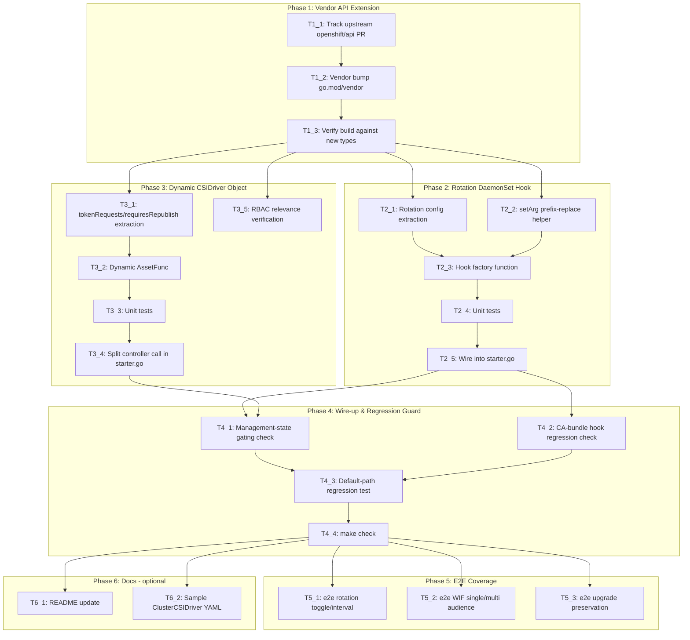

# Execution Backlog
**Feature:** Configurable Secret Rotation and Workload Identity Federation for the Secrets Store CSI Driver
**AgentRoutingMode:** PROVIDED
**ConstitutionVersion:** 1.0.0

**Agent roster note:** `constitution.md`'s metadata declares `AgentRoutingMode: PROVIDED`, but the resolved `agents.md` (root `AGENTS.md`, per `plan.md` §0) contains no formal agent-ID routing table. Per input precedence (`constitution.md` ranks above `agents.md`), this backlog derives its **PROVIDED** agent roster from `constitution.md`'s own "Code Ownership" table (§ Code Ownership) rather than falling back to the fully-provisional taxonomy — three of its five areas already coincide with the provisional IDs (`Tests`→`Testing_Agent`, `Docs`→`Docs_Agent`, `OLM / release`→`OLMRelease_Agent`), so this is a light adaptation, not an invention:

| Assigned Agent | Constitution "Code Ownership" area | Key paths |
|---|---|---|
| `ControllerLogic_Agent` | Controller logic | `pkg/operator/starter.go`, `go.mod`/`vendor/` (nearest owning area — not explicitly listed in the ownership table; see Task T1_2 note) |
| `StaticAssets_Agent` | Static assets | `assets/`, `assets/rbac/`, `assets/network-policy/` |
| `OLMRelease_Agent` | OLM / release | `config/manifests/`, `hack/update-metadata.sh` (not used by this feature, listed for roster completeness only) |
| `Testing_Agent` | Tests | `pkg/operator/*_test.go`, `hack/e2e.sh` |
| `Docs_Agent` | Docs | `README.md`, `must-gather/` |

## 0. Input coverage checklist

- **US1** (P1, disable/enable rotation) → T2_1, T2_3, T2_5
- **US2** (P1, WIF token audiences) → T3_1, T3_2, T3_4
- **US3** (P2, tune rotation interval) → T2_1, T2_3
- **US4** (P2, multi-cloud audiences) → T3_1, T3_2
- **FR-001** (enable/disable via cluster-wide config) → T2_1, T2_3
- **FR-002** (custom interval, 1s–~1yr bounds) → T2_1, T2_3
- **FR-003** (default rotation behavior when unconfigured) → T2_1, T4_3
- **FR-004** (configure token audiences) → T3_1, T3_2
- **FR-005** (preserve existing tokenRequests when omitted) → T3_1, T3_2
- **FR-006** (reject reverting managed→unmanaged) → T3_1 (read-only observation; enforcement is the upstream CRD's CEL rule — see Non-goals in T3_1/T3_2)
- **FR-007** (clear via explicit empty audience list) → T3_1, T3_2
- **FR-008** (validate bounds at submission, reject before apply) → T1_3 (upstream CRD-level validation; this repo only reads already-validated objects — see Non-goals in T3_1)
- **FR-009** (propagate without manual restart) → T2_5, T3_4 (inherent in controller resync — no new task needed beyond wiring)
- **FR-010** (retain settings across upgrades/restarts) → T4_3
- **FR-011** (disabled rotation stops periodic refresh) → T2_1, T2_3
- **FR-012** (no behavior change for non-opted-in clusters) → T4_3
- **SC-001…SC-007** (all measurable outcomes) → T5_1, T5_2, T5_3 (E2E), plus manual runbook steps carried into T6_1 if executed
- **Plan Phase 1** (vendor API extension) → T1_1, T1_2, T1_3
- **Plan Phase 2** (rotation DaemonSet hook) → T2_1, T2_2, T2_3, T2_4, T2_5
- **Plan Phase 3** (dynamic CSIDriver object) → T3_1, T3_2, T3_3, T3_4, T3_5
- **Plan Phase 4** (wire-up + regression guard) → T4_1, T4_2, T4_3, T4_4
- **Plan Phase 5** (E2E coverage) → T5_1, T5_2, T5_3
- **Plan Phase 6** (docs, optional) → T6_1, T6_2
- **Plan §8 Open Question #4** (RBAC relevance) → T3_5 (discovery task, `Evidence: PARTIAL`)
- **Plan §8 Open Questions #1–#3** (downgrade behavior, exact upstream type names, TechPreview gating) → not resolvable by any task in this repo; carried to §5 Orchestration Notes as SME blockers, not assigned a Task ID (per plan.md, this repo's code must not invent answers)

## 1. Task Dependency Graph (Mermaid)

## 2. Linear Execution Order (Chronological)

1. T1_1 — Track upstream `openshift/api` PR merge status
2. T1_2 — Vendor bump `go.mod`/`vendor` for the new `SecretsStore` types
3. T1_3 — Verify build compiles against new types
4. T2_1 — Rotation config extraction (nil-safety + defaults)
5. T2_2 — `setArg` prefix-replace helper
6. T2_3 — `DaemonSetHookFunc` factory function
7. T2_4 — Unit tests for rotation hook
8. T2_5 — Wire rotation hook into `starter.go`
9. T3_1 — `tokenRequests`/`requiresRepublish` extraction (nil-path preservation matrix)
10. T3_2 — Dynamic `AssetFunc` for `csidriver.yaml`
11. T3_3 — Unit tests for dynamic CSIDriver asset
12. T3_4 — Split `csidriver.yaml` into its own controller call in `starter.go`
13. T3_5 — RBAC relevance verification (discovery)
14. T4_1 — Management-state gating verification
15. T4_2 — CA-bundle hook regression check
16. T4_3 — Default-path regression test
17. T4_4 — `make check`
18. T5_1 — E2E: rotation toggle/interval
19. T5_2 — E2E: WIF single/multi audience
20. T5_3 — E2E: upgrade preservation
21. T6_1 — README update (optional)
22. T6_2 — Sample `ClusterCSIDriver` YAML (optional)

## 3. Task Execution Manifest

| Task ID | Task Title | Assigned Agent | Phase | Depends On | Parallel OK | Complexity | Risk |
|---------|-----------|-----------------|-------|-----------|-------------|------------|------|
| T1_1 | Track upstream `openshift/api` PR merge status | `ControllerLogic_Agent` | Phase 1 | none | No | 1 | Med |
| T1_2 | Vendor bump `go.mod`/`vendor` for new types | `ControllerLogic_Agent` | Phase 1 | T1_1 | No | 2 | Med |
| T1_3 | Verify build compiles against new types | `ControllerLogic_Agent` | Phase 1 | T1_2 | No | 1 | Low |
| T2_1 | Rotation config extraction (nil-safety + defaults) | `ControllerLogic_Agent` | Phase 2 | T1_3 | Yes | 3 | Med |
| T2_2 | `setArg` prefix-replace helper | `ControllerLogic_Agent` | Phase 2 | T1_3 | Yes | 1 | Low |
| T2_3 | `DaemonSetHookFunc` factory function | `ControllerLogic_Agent` | Phase 2 | T2_1, T2_2 | No | 2 | Med |
| T2_4 | Unit tests for rotation hook | `Testing_Agent` | Phase 2 | T2_3 | No | 3 | Low |
| T2_5 | Wire rotation hook into `starter.go` | `ControllerLogic_Agent` | Phase 2 | T2_4 | No | 2 | Med |
| T3_1 | `tokenRequests`/`requiresRepublish` extraction | `ControllerLogic_Agent` | Phase 3 | T1_3 | Yes | 5 | High |
| T3_2 | Dynamic `AssetFunc` for `csidriver.yaml` | `ControllerLogic_Agent` | Phase 3 | T3_1 | No | 5 | High |
| T3_3 | Unit tests for dynamic CSIDriver asset | `Testing_Agent` | Phase 3 | T3_2 | No | 3 | Med |
| T3_4 | Split `csidriver.yaml` into its own controller call | `ControllerLogic_Agent` | Phase 3 | T3_3 | No | 3 | Med |
| T3_5 | RBAC relevance verification (discovery) | `RBACSecurity_Agent`\* | Phase 3 | T1_3 | Yes | 1 | Low |
| T4_1 | Management-state gating verification | `ControllerLogic_Agent` | Phase 4 | T2_5, T3_4 | No | 2 | Med |
| T4_2 | CA-bundle hook regression check | `ControllerLogic_Agent` | Phase 4 | T2_5 | Yes | 1 | Low |
| T4_3 | Default-path regression test | `Testing_Agent` | Phase 4 | T4_1, T4_2 | No | 3 | Med |
| T4_4 | `make check` | `Testing_Agent` | Phase 4 | T4_3 | No | 1 | Low |
| T5_1 | E2E: rotation toggle/interval | `Testing_Agent` | Phase 5 | T4_4 | No\*\* | 3 | Med |
| T5_2 | E2E: WIF single/multi audience | `Testing_Agent` | Phase 5 | T4_4 | No\*\* | 5 | High |
| T5_3 | E2E: upgrade preservation | `Testing_Agent` | Phase 5 | T4_4 | No\*\* | 3 | Med |
| T6_1 | README update (optional) | `Docs_Agent` | Phase 6 | T4_4 | Yes | 1 | Low |
| T6_2 | Sample `ClusterCSIDriver` YAML (optional) | `Docs_Agent` | Phase 6 | T4_4 | Yes | 1 | Low |

\* `RBACSecurity_Agent` is not one of the five areas in `constitution.md`'s Code Ownership table (RBAC assets fall under "Static assets" there); used here as the more precise provisional-taxonomy ID since this task is narrowly about RBAC semantics, not general asset editing. Flagged for consistency in §5.
\*\* T5_1–T5_3 all edit the same file (`hack/e2e.sh`) — marked `Parallel OK: No` to avoid merge conflicts; see §5 Merge Conflict Hotspots.

## 4. Task Specifications (Payloads)

### Task T1_1: Track upstream `openshift/api` PR merge status
- **Status:** Completed — see `implementation/task-reports/T1_1.md`
- **Objective:** Confirm whether the `openshift/api` PR implementing `SecretsStore`/`secretRotation`/`tokenRequests` (per `openspec/inputs/ep.md` §"API Extensions") has merged, and capture its exact merged type/field names and validation semantics.
- **Target file(s):** None in this repo — this is an external-repository discovery task (`repo-assessment.md` §11 CRITICAL risk; `plan.md` §4/§8 Open Question #2).
- **Non-goals / forbidden edits:** Do not hand-author or hand-edit any file under `vendor/github.com/openshift/api/` to simulate the merge — vendor changes must track a real upstream commit (Constitution Principle X).
- **Implementation notes:** Evidence: PARTIAL — this repo has no visibility into the external PR's status. Re-verify the actual type names against `plan.md` §3.2's illustrative names before starting T1_2; do not assume the illustrative names are final.
- **Acceptance criteria:** A specific upstream commit SHA (or tag) of `github.com/openshift/api` containing the merged types is identified and recorded for use in T1_2. Traces to `plan.md` Phase 1 Dependencies.
- **Downstream handoff:** The confirmed commit reference and actual type/field names, for T1_2 to vendor and for T2_1/T3_1 to code against.

### Task T1_2: Vendor bump `go.mod`/`vendor` for new types
- **Status:** Completed — see `implementation/task-reports/T1_2.md`
- **Objective:** Update `github.com/openshift/api` (and `github.com/openshift/client-go` if new apply-configuration types are needed for `ExtractClusterCSIDriver`) to the commit identified in T1_1.
- **Target file(s):** `go.mod`, `go.sum`, `vendor/github.com/openshift/api/operator/v1/types_csi_cluster_driver.go` (and related `zz_generated.deepcopy.go`/apply-configuration files) — all regenerated by tooling, never hand-edited (`repo-assessment.md` §6 API/Schema guardrail; Constitution Principle X). Note: `go.mod`/`vendor` bumps are not explicitly named in `constitution.md`'s Code Ownership table; routed to `ControllerLogic_Agent` as the nearest owning area since `pkg/operator/` is the sole consumer of these types.
- **Non-goals / forbidden edits:** Do not modify any other vendored package as part of this bump beyond what `go mod tidy && go mod vendor` produces automatically.
- **Implementation notes:** Run `go mod tidy && go mod vendor` after editing the `require` line in `go.mod`. Evidence: PARTIAL until T1_1's commit reference is confirmed.
- **Acceptance criteria:** `go.mod`/`go.sum`/`vendor/` reflect the new `openshift/api` commit; `opv1.CSIDriverConfigSpec` (or equivalent) contains a `SecretsStore` field and `CSIDriverType` includes the new enum value, importable from `pkg/operator/`. Traces to `plan.md` Phase 1 Target files.
- **Downstream handoff:** A compiling `vendor/` tree with the new types available for T1_3 to verify and T2_1/T3_1 to consume.

### Task T1_3: Verify build compiles against new types
- **Status:** Completed — see `implementation/task-reports/T1_3.md`
- **Objective:** Confirm the vendored bump from T1_2 compiles cleanly and passes existing verification.
- **Target file(s):** None (verification-only task); runs against the whole repo.
- **Non-goals / forbidden edits:** No production code changes in this task.
- **Implementation notes:** Run `go build ./...` then `make verify` (per `docs/testing-guidelines.md`/Constitution Principle V — `verify` chains `go vet`, `gofmt`, Go version consistency, and `verify-deps` from `build-machinery-go`, which confirms `vendor/` matches `go.mod`).
- **Acceptance criteria:** `go build ./...` and `make verify` both exit 0. Traces to `plan.md` Phase 1 Verification hooks (FR-008's upstream-validation dependency is unblocked once this passes).
- **Downstream handoff:** A green build baseline for Phase 2 and Phase 3 to branch from in parallel.

### Task T2_1: Rotation config extraction (nil-safety + defaults)
- **Status:** Completed — see `implementation/task-reports/T2_1.md`
- **Objective:** Implement a pure function that reads a `ClusterCSIDriver`'s `driverConfig.secretsStore.secretRotation` and returns the effective enable-flag and poll-interval, handling every nil-path from `openspec/inputs/ep.md`'s Test Plan (nil `driverConfig`; nil `secretsStore`; nil `secretRotation` → default `true`/`2m`; `type: None` → `false`; `type: Custom` with `minimumRefreshAge` → derived interval; `type: Custom` with omitted `minimumRefreshAge` → default `120s`).
- **Target file(s):** New `pkg/operator/rotation.go` (repo-assessment §2 confirms `pkg/operator/` currently has only `starter.go`/`starter_test.go` — this is a new file, not an edit to an existing one).
- **Non-goals / forbidden edits:** Do not touch `pkg/operator/starter.go` in this task (wiring happens in T2_5). Do not implement bounds validation (1s–~1yr) here — that is enforced by the upstream CRD schema (FR-008), not this operator's Go code.
- **Implementation notes:** Follow `docs/error-handling-guidelines.md` (error wrapping with `%w`, lowercase-verb messages) if the function can error; otherwise a pure value-returning function with no error path is preferable per the plan's "no new persistence/complexity" framing (`plan.md` §2).
- **Acceptance criteria:** Traces to FR-001, FR-002, FR-003, FR-011; unit-testable in isolation ahead of T2_4.
- **Downstream handoff:** A named function/type for T2_3's hook factory to call.

### Task T2_2: `setArg` prefix-replace helper
- **Objective:** Implement a small utility that finds a container-arg string by its `--flag=` prefix in a `[]string` and replaces it (or appends if absent), for use on the `csi-driver` container's `args` in `node.yaml`.
- **Target file(s):** `pkg/operator/rotation.go` (same new file as T2_1, or a small separate file if preferred — no existing equivalent helper exists anywhere in this repo or its vendored dependencies per `repo-assessment.md` §7).
- **Non-goals / forbidden edits:** Do not hardcode the `csi-driver` container name lookup here — that belongs in T2_3, which has access to the full `*appsv1.DaemonSet`.
- **Implementation notes:** Keep this function generic (`func setArg(args []string, prefix, value string) []string`) so it is independently unit-testable and reusable if a similar need arises elsewhere.
- **Acceptance criteria:** Correctly replaces an existing `--enable-secret-rotation=` /`--rotation-poll-interval=` entry in place without reordering unrelated args; unit-tested directly.
- **Downstream handoff:** A reusable helper for T2_3.

### Task T2_3: `DaemonSetHookFunc` factory function
- **Objective:** Implement a factory function returning a `csidrivernodeservicecontroller.DaemonSetHookFunc` (signature `func(*opv1.OperatorSpec, *appsv1.DaemonSet) error`), modeled directly on `csidrivernodeservicecontroller.WithCABundleDaemonSetHook` (`vendor/.../csidrivernodeservicecontroller/helpers.go:32`): it must close over a way to read the live `ClusterCSIDriver` (not rely on its `*opv1.OperatorSpec` parameter, which does not carry `DriverConfig` — `repo-assessment.md` §1.3 trap), call T2_1's extraction function, find the `csi-driver` container by name, and use T2_2's helper to set both args.
- **Target file(s):** `pkg/operator/rotation.go`.
- **Non-goals / forbidden edits:** Do not modify `WithCABundleDaemonSetHook` itself or any vendored file. Do not add the resulting hook to `starter.go` in this task (that is T2_5).
- **Implementation notes:** The exact lister/getter mechanism for reading the live `ClusterCSIDriver` is `Evidence: PARTIAL` until implementation time (`plan.md` §3.2 / Open Question #2) — options include the `dynamicInformers`/`dynamicClient` already constructed in `starter.go`, or a new typed lister; this task should choose the simplest option available once T1_2's real types are vendored, and document the choice in code comments.
- **Acceptance criteria:** Traces to FR-001, FR-002, FR-003, FR-011; returns a function matching the exact `DaemonSetHookFunc` signature with no compilation changes needed to `WithCSIDriverNodeService`'s call site beyond adding it to the variadic list (T2_5).
- **Downstream handoff:** A ready-to-register hook value for T2_5.

### Task T2_4: Unit tests for rotation hook
- **Objective:** Table-driven unit tests covering T2_1's full nil-path matrix and T2_3's arg-mutation behavior, following `pkg/operator/starter_test.go`'s exact shape (`v1helpers.NewFakeOperatorClientWithObjectMeta`, `t.Run`, `t.Fatalf` — `docs/testing-guidelines.md`).
- **Target file(s):** New `pkg/operator/rotation_test.go`.
- **Non-goals / forbidden edits:** No third-party assertion libraries (Constitution / `docs/testing-guidelines.md` — standard `if`/`t.Fatalf`/`t.Errorf` only).
- **Implementation notes:** Cases must include: nil `driverConfig`; nil `secretsStore`; nil `secretRotation` (defaults `true`/`2m`); `type: None` (`false`, stop-refresh); `type: Custom` with explicit interval; `type: Custom` with omitted interval (default `120s`); arg-replace-by-prefix correctness on a sample DaemonSet fixture built inline (per `docs/testing-guidelines.md`, no external fixture files).
- **Acceptance criteria:** `go test ./pkg/operator/...` passes; traces to FR-001, FR-002, FR-003, FR-011 and the Verification Matrix "Unit" row in `plan.md` §6.
- **Downstream handoff:** Passing tests as a precondition for T2_5's integration into `starter.go`.

### Task T2_5: Wire rotation hook into `starter.go`
- **Objective:** Register T2_3's hook as an additional `optionalDaemonSetHooks` argument to the existing `WithCSIDriverNodeService(...)` call, alongside (never replacing) `WithCABundleDaemonSetHook` (Constitution Principle VIII). Decide whether to add a `ClusterCSIDriver`-derived informer to the currently-`nil` `optionalInformers` slice (`starter.go:110`) for event-driven resync, or accept the controller's existing 1-minute `ResyncEvery` (`repo-assessment.md` §1.3/§11 risk #2) — document the choice.
- **Target file(s):** `pkg/operator/starter.go`.
- **Non-goals / forbidden edits:** Do not touch the `WithConditionalStaticResourcesController` call (Phase 3's concern) in this task.
- **Implementation notes:** This is the only task in Phase 2 that touches the shared `starter.go` file — sequence it after T2_4 (tests passing) to minimize risk of needing rework.
- **Acceptance criteria:** `RunOperator` compiles and starts with both hooks registered; `WithCABundleDaemonSetHook` remains present (verified again in T4_2). Traces to FR-009 (propagation without manual restart, via existing resync/informer mechanics).
- **Downstream handoff:** A functioning rotation-hook wiring for T4_1/T4_2 to regression-check.

### Task T3_1: `tokenRequests`/`requiresRepublish` extraction (nil-path preservation matrix)
- **Objective:** Implement a function that computes the desired `CSIDriver.spec.requiresRepublish` (mirrors `secretRotation.type` per `specs.md` Edge Cases) and `CSIDriver.spec.tokenRequests` from a `ClusterCSIDriver`, implementing the **full preservation matrix** from `openspec/inputs/ep.md`'s Test Plan: `DriverType != SecretsStore` with existing live `CSIDriver` tokenRequests → return existing (not nil); `SecretsStore` nil with existing live tokenRequests → return existing; no `driverConfig`/no existing CSIDriver → nil, no error; `type: Managed` with `managed.audiences` → return exactly those; `type: Managed` with empty `managed.audiences` → return an explicit empty list (clears); `type: Unmanaged` (or omitted) → preserve existing live tokenRequests.
- **Target file(s):** New `pkg/operator/csidriver_asset.go` (new file — `repo-assessment.md` §2 confirms no existing equivalent).
- **Non-goals / forbidden edits:** Do **not** implement the "cannot revert from Managed" immutability check here — that is enforced by the upstream CRD's CEL rule (FR-006); this function only reads already-validated objects and must not duplicate that logic (`repo-assessment.md` §11 risk #4 / `plan.md` §7). Do not implement bounds validation (FR-008) — upstream CRD concern.
- **Implementation notes:** This function needs read access to the **live** `CSIDriver` object (for the preservation paths), not just the `ClusterCSIDriver` — likely via the `kubeClient`/informer already available in `starter.go`, or a `storagev1.CSIDriver` lister. `Evidence: PARTIAL` on the exact lister mechanism until implementation time, same caveat as T2_3.
- **Acceptance criteria:** Traces to FR-004, FR-005, FR-006 (read-only observation), FR-007; the six-way nil-path matrix above is fully covered. This is the highest-risk task in the backlog (`Risk: High`) given the matrix's size and the immutability-adjacent semantics.
- **Downstream handoff:** A named function for T3_2's `AssetFunc` to call.

### Task T3_2: Dynamic `AssetFunc` for `csidriver.yaml`
- **Objective:** Implement a `resourceapply.AssetFunc`-compatible function (`func(name string) ([]byte, error)`) that reads the base `assets/csidriver.yaml` (via the existing `assets.ReadFile`/`replaceNamespaceFunc` for `${NAMESPACE}` substitution — do not duplicate that logic), deserializes it, applies T3_1's computed `requiresRepublish`/`tokenRequests`, and re-serializes it for `StaticResourceController`/`resourceapply.ApplyDirectly` to apply via the **existing, unmodified** `resourceapply.ApplyCSIDriver` hash-recreate path (`vendor/.../resourceapply/storage.go:141` — reuse, do not reimplement).
- **Target file(s):** `pkg/operator/csidriver_asset.go`.
- **Non-goals / forbidden edits:** Do not modify `resourceapply.ApplyCSIDriver` or any vendored file. Do not modify `assets/csidriver.yaml`'s static content — it remains the unmutated starting point.
- **Implementation notes:** Should wrap or call through `replaceNamespaceFunc` for the `${NAMESPACE}` token so namespace substitution is not dropped (`repo-assessment.md` §5 reuse mandate).
- **Acceptance criteria:** Traces to FR-004 through FR-007 (rendering half of the matrix from T3_1); produces valid `storagev1.CSIDriver` YAML bytes that `resourceread.ReadGenericWithUnstructured` can parse.
- **Downstream handoff:** A ready-to-register `AssetFunc` for T3_4's controller-call split.

### Task T3_3: Unit tests for dynamic CSIDriver asset
- **Objective:** Table-driven unit tests covering T3_1's full six-way nil-path preservation matrix and T3_2's rendering correctness (namespace substitution preserved, valid YAML produced), following `starter_test.go`'s shape.
- **Target file(s):** New `pkg/operator/csidriver_asset_test.go`.
- **Non-goals / forbidden edits:** No third-party assertion libraries.
- **Implementation notes:** Construct fake live `CSIDriver` objects inline (per `docs/testing-guidelines.md`, no external fixtures) to exercise the preservation paths.
- **Acceptance criteria:** `go test ./pkg/operator/...` passes; traces to FR-004–FR-007 and `plan.md` §6 Verification Matrix "Unit" row.
- **Downstream handoff:** Passing tests as a precondition for T3_4.

### Task T3_4: Split `csidriver.yaml` into its own controller call
- **Objective:** Modify `starter.go` to remove `"csidriver.yaml"` from the shared 8-file `WithConditionalStaticResourcesController` call's file list and register a **second**, dedicated `WithConditionalStaticResourcesController` call scoped to `["csidriver.yaml"]` using T3_2's dynamic `AssetFunc` — per `repo-assessment.md` §1.3 Option (b) / §11 risk #3, to avoid the blast-radius risk of branching inside the currently-shared `replaceNamespaceFunc`.
- **Target file(s):** `pkg/operator/starter.go`.
- **Non-goals / forbidden edits:** Do not change the `shouldCreateFn`/`shouldDeleteFn` gating semantics for the remaining 7 files in the original call — they must continue to gate on `getOperatorSyncState` exactly as before (Constitution Principle IV). The new `csidriver.yaml`-only call must **also** gate on `getOperatorSyncState` identically.
- **Implementation notes:** This is the task most likely to introduce a regression if done carelessly, since it changes an existing, working controller registration — keep the diff minimal (move one string out of one list, add one new chained call).
- **Acceptance criteria:** `RunOperator` compiles; both controller instances register successfully; traces to FR-009 (propagation via existing resync mechanics, now split across two controller instances).
- **Downstream handoff:** A functioning dynamic-CSIDriver wiring for T4_1 to regression-check.

### Task T3_5: RBAC relevance verification (discovery)
- **Objective:** Determine whether the pre-existing `serviceaccounts/token: create` RBAC grant (`assets/rbac/secretproviderclasses_role.yaml`, commented "for CSI driver token requests") is relevant to, sufficient for, or unrelated to the new kubelet-driven WIF `tokenRequests` mechanism (`repo-assessment.md` §3.3/§11.1; `plan.md` §8 Open Question #4).
- **Target file(s):** None to start (discovery); potentially `assets/rbac/secretproviderclasses_role.yaml` if a gap is found (Constitution Principle VI — any RBAC change MUST be a YAML file in `assets/rbac/`, never inline/dynamic).
- **Non-goals / forbidden edits:** Do not add or remove RBAC without a documented finding — no speculative RBAC edits.
- **Implementation notes:** `Evidence: PARTIAL` — requires reading the upstream `secrets-store-csi-driver` binary's actual token-consumption code, a separate repository not accessible from this one during planning. Assigned to `RBACSecurity_Agent` (provisional ID; not one of `constitution.md`'s five Code Ownership areas — flagged in §3 footnote and repeated in §5).
- **Acceptance criteria:** A documented finding (no-change-needed, or a specific new/edited RBAC YAML file) recorded before Phase 4 completes; traces to `repo-assessment.md` §3.4 (RBAC/security boundaries).
- **Downstream handoff:** Either "no RBAC change" confirmation, or a new RBAC task to be added ad hoc if a gap is found (not pre-created here, per the plan's "do not invent" boundary).

### Task T4_1: Management-state gating verification
- **Objective:** Explicitly verify both new mechanisms (T2_5's rotation hook, T3_4's dynamic CSIDriver controller) correctly respect `getOperatorSyncState`/the parent controllers' existing Managed/Unmanaged/Removed gating (Constitution Principle IV) — i.e., no new unconditional resource writes were introduced.
- **Target file(s):** `pkg/operator/starter.go` (review only, changes only if a gap is found).
- **Non-goals / forbidden edits:** This is a verification task, not a feature-implementation task — avoid unrelated refactors.
- **Implementation notes:** Both mechanisms ride on their parent controllers' existing gating (`WithCSIDriverNodeService`'s `syncManaged`/`syncDeleting` split; `WithConditionalStaticResourcesController`'s `shouldCreateFn`/`shouldDeleteFn`) — this task confirms that inheritance holds, it does not add new gating logic.
- **Acceptance criteria:** No code path in the new hook/`AssetFunc` writes to the cluster outside of Managed state; documented confirmation (code review notes or a targeted test) traces to Constitution Principle IV.
- **Downstream handoff:** Confirmation feeding into T4_3's regression test.

### Task T4_2: CA-bundle hook regression check
- **Objective:** Confirm `WithCABundleDaemonSetHook` remains registered and functionally unchanged after T2_5's edit added the new rotation hook to the same variadic argument list (Constitution Principle VIII — mandatory, must not regress).
- **Target file(s):** `pkg/operator/starter.go` (review); `pkg/operator/rotation_test.go` or a new small test if a gap is found.
- **Non-goals / forbidden edits:** Do not modify `WithCABundleDaemonSetHook` itself.
- **Implementation notes:** A quick assertion that the DaemonSet's rendered containers still receive CA-bundle injection when the ConfigMap is present is sufficient — no need to re-test the CA-bundle hook's own internal logic (already covered by its vendored implementation).
- **Acceptance criteria:** Confirmation that both hooks coexist correctly in the `optionalDaemonSetHooks` slice without one clobbering the other's mutations to the DaemonSet.
- **Downstream handoff:** Confirmation feeding into T4_3.

### Task T4_3: Default-path regression test
- **Objective:** Add a regression test asserting that when `ClusterCSIDriver.spec.driverConfig` is absent (the pre-feature, still-most-common state), the rendered DaemonSet args and `CSIDriver` spec are **identical** to the documented pre-feature baseline (`repo-assessment.md` §3.2: `--enable-secret-rotation=true`, `--rotation-poll-interval=2m`, no `requiresRepublish`/`tokenRequests` set) — implementing FR-003/FR-010/FR-012's "zero behavior change for unconfigured clusters" requirement.
- **Target file(s):** `pkg/operator/rotation_test.go` and/or `pkg/operator/csidriver_asset_test.go` (extend, do not duplicate T2_4/T3_3's existing nil-path cases if already covered — this task's distinguishing value is asserting the **exact literal values** match the historical baseline, not just "no error").
- **Non-goals / forbidden edits:** No production code changes in this task unless the regression test reveals an actual defect (in which case, fix and note the finding — do not silently adjust the test to match wrong behavior).
- **Implementation notes:** This is the single test most directly protecting existing clusters from an unintended behavior change on upgrade — treat it as a release-blocking check, not optional coverage.
- **Acceptance criteria:** Test passes with the exact baseline values from `repo-assessment.md` §3.2; traces to FR-003, FR-010, FR-012 and `specs.md` SC-005.
- **Downstream handoff:** A green regression suite as input to T4_4's full `make check` run.

### Task T4_4: `make check`
- **Objective:** Run the full mandatory pre-PR verification chain (Constitution Principle V).
- **Target file(s):** None (verification-only; runs against the whole repo).
- **Non-goals / forbidden edits:** No code changes in this task except fixing any `make verify` (formatting/vet) failures surfaced.
- **Implementation notes:** `make check` chains `make verify` (go vet, gofmt, Go version consistency) and `make test-unit` (`go test ./pkg/... ./cmd/...`).
- **Acceptance criteria:** `make check` exits 0.
- **Downstream handoff:** A verified, mergeable state as the precondition for Phase 5 (E2E, requires a real cluster build) and Phase 6 (docs).

### Task T5_1: E2E: rotation toggle/interval
- **Objective:** Extend `hack/e2e.sh` with test scenarios for US1/US3: rotation disable → no periodic refresh; rotation re-enable → refresh resumes; custom interval → refresh cadence matches; per `specs.md` SC-001/SC-002 and `openspec/inputs/ep.md`'s E2E scenario list ("Secret Rotation scenarios").
- **Target file(s):** `hack/e2e.sh` (extend the existing `test_*` bash-function style — `test_prechecks`, `test_setup`, `test_pod_with_secret`, etc.; `repo-assessment.md` §8.4 confirms zero existing rotation assertions today).
- **Non-goals / forbidden edits:** Do not remove or alter the existing `test_pod_with_secret` baseline scenario.
- **Implementation notes:** Requires a live OpenShift cluster with the updated operator+driver deployed — not runnable in a planning/authoring environment; this task's completion is verified in CI/on a real cluster, not locally.
- **Acceptance criteria:** New `test_*` functions added and wired into the script's execution sequence; traces to SC-001, SC-002.
- **Downstream handoff:** Extended `hack/e2e.sh` for T5_2/T5_3 to build on (same file — sequence to avoid merge conflicts, see §5).

### Task T5_2: E2E: WIF single/multi audience
- **Objective:** Extend `hack/e2e.sh` with scenarios for US2/US4: configure a single token audience and confirm the driver receives/uses it; configure multiple audiences (e.g., AWS + Azure per ep.md) and confirm both are independently usable; per `specs.md` SC-003/SC-004.
- **Target file(s):** `hack/e2e.sh`.
- **Non-goals / forbidden edits:** Do not implement actual cloud-provider authentication test infrastructure (AWS STS, Azure AD) — that is outside this operator's/repo's scope (`repo-assessment.md` §10.3); scenarios should verify the `CSIDriver.spec.tokenRequests` field and the token being made available to the driver via `NodePublishVolume`, not full cloud-provider round-trip auth unless the existing `e2e-provider` test fixture already supports it.
- **Implementation notes:** This is the highest-risk task in the backlog (`Risk: High`) given it is new territory (no existing WIF test scaffolding) and depends on the still-unverified upstream API shape (T1_1).
- **Acceptance criteria:** New `test_*` functions added; traces to SC-003, SC-004.
- **Downstream handoff:** Extended `hack/e2e.sh` for T5_3.

### Task T5_3: E2E: upgrade preservation
- **Objective:** Extend `hack/e2e.sh` (or document as a separate upgrade-test runbook if the existing script's structure doesn't fit an upgrade scenario) to verify that a cluster with pre-existing, manually-configured `CSIDriver.spec.tokenRequests` and no `driverConfig.secretsStore` set retains that configuration and its existing rotation cadence after the operator upgrades to include this feature — per `repo-assessment.md` §11 (the highest-impact untested path today) and `specs.md` SC-005.
- **Target file(s):** `hack/e2e.sh`.
- **Non-goals / forbidden edits:** Do not invent a new upgrade-testing framework — reuse whatever mechanism CI already has for upgrade-path Prow jobs if one exists (`Evidence: PARTIAL` — this repo's own `hack/e2e.sh` does not currently model an upgrade scenario; `repo-assessment.md` did not find one).
- **Implementation notes:** If no upgrade-testing mechanism exists anywhere in the current CI setup, this task's acceptance criterion may need to be narrowed to a manual runbook step (documented in T6_1) rather than an automated test — flag this narrowing explicitly if it happens, do not silently drop coverage.
- **Acceptance criteria:** Either an automated `hack/e2e.sh` scenario, or an explicitly-documented manual verification runbook step, covering the upgrade-preservation path; traces to SC-005.
- **Downstream handoff:** Final e2e coverage state for the feature, ready for review.

### Task T6_1: README update (optional)
- **Objective:** Document the new `secretRotation`/`tokenRequests` configuration surface in `README.md`, including the manual verification commands from `openspec/inputs/ep.md` §"Support Procedures" (`oc get csidriver ... -o yaml`, `oc get ds ... -o jsonpath=...`).
- **Target file(s):** `README.md`.
- **Non-goals / forbidden edits:** Do not modify `hack/update-metadata.sh`-managed version strings as part of this doc update (Constitution Principle IX — those are script-managed only).
- **Implementation notes:** Not required by any FR in `specs.md` — purely a discoverability improvement (`plan.md` Phase 6).
- **Acceptance criteria:** New section added to `README.md` describing the feature and how to verify it manually.
- **Downstream handoff:** N/A — terminal task.

### Task T6_2: Sample `ClusterCSIDriver` YAML (optional)
- **Objective:** Add a new sample manifest demonstrating `driverConfig.secretsStore` configuration, following the existing pattern of `config/manifests/stable/sscsi-sample-secretproviderclass-*.yaml` (which currently only demonstrate `SecretProviderClass`, not `ClusterCSIDriver` — `repo-assessment.md` §10.5).
- **Target file(s):** New `config/manifests/stable/sscsi-sample-clustercsidriver-secretsstore.yaml` (illustrative name — not required by any FR).
- **Non-goals / forbidden edits:** Do not modify any existing sample YAML file; add a new one only.
- **Implementation notes:** Purely illustrative/optional; can be dropped without affecting any FR/SC if time-constrained.
- **Acceptance criteria:** A new, valid sample YAML file demonstrating the feature's configuration syntax.
- **Downstream handoff:** N/A — terminal task.

## 5. Orchestration notes (non-code)

### Retry Boundaries
- **T1_1 (external tracking)** can be retried indefinitely with no side effects — it is pure discovery/monitoring.
- **T1_2 (vendor bump)** is safely retryable: `go mod tidy && go mod vendor` is idempotent given a fixed target commit; re-running after a failed attempt is safe.
- **T2_1–T2_4, T3_1–T3_3 (pure Go code + unit tests)** are safely retryable in isolation — no shared mutable state, standard code-then-test iteration.
- **T2_5, T3_4 (edits to the shared `starter.go`)** should NOT be retried by discarding and re-generating the whole file — these are targeted edits to an existing, working file; a failed attempt should be diffed and corrected, not wholesale regenerated, to avoid clobbering unrelated existing content (the `CSIConfigObserverController` registration, `extractOperatorSpec`/`extractOperatorStatus`, etc.).
- **T4_3, T4_4 (regression test + `make check`)** are safely retryable — deterministic verification commands.
- **T5_1–T5_3 (e2e)** require a live cluster; a failed attempt should be retried only after confirming cluster/operator state is clean (per `hack/e2e.sh`'s own `test_teardown` pattern) to avoid false failures from leftover test namespaces.

### Merge Conflict Hotspots
- **`pkg/operator/starter.go`** — touched by T2_5, T3_4, and reviewed (not necessarily edited) by T4_1/T4_2. T2_5 and T3_4 are marked `Parallel OK: No` relative to each other implicitly via the DAG structure (both are the last task in their respective phases before Phase 4) — sequence them (either order is fine, they touch different parts of the same file: the `WithCSIDriverNodeService` call vs. the `WithConditionalStaticResourcesController` call) and rebase/merge carefully rather than working from stale copies of the file.
- **`hack/e2e.sh`** — touched by T5_1, T5_2, T5_3 sequentially (all marked `Parallel OK: No` for this reason). Each should be a small, additive diff (new `test_*` functions + one new call in the script's linear execution section at the bottom) to minimize conflict surface.
- **`vendor/github.com/openshift/api/...` and related `zz_generated`/apply-configuration files** — exclusively owned by T1_2's `go mod vendor` output; no other task should hand-edit anything under `vendor/` (Constitution Principle X). This is the single highest-risk hotspot for accidental manual edits being silently reverted by a later `go mod vendor` run.
- **`assets/rbac/secretproviderclasses_role.yaml`** — only touched by T3_5 if its discovery finds a gap; low conflict risk since no other task in this backlog edits RBAC assets.

### Open Questions Requiring SME Before Execution
- **Plan §8 Open Question #1** (downgrade behavior after `tokenRequests.type: Managed`): blocks a fully confident answer for **T3_1** and **T5_3** (upgrade/downgrade e2e scope) — until an SME/API-owner decision arrives, T3_1 implements only the documented upgrade-preservation behavior and explicitly does not attempt to handle downgrade; T5_3 scopes its "upgrade preservation" test to upgrade only, not round-trip downgrade.
- **Plan §8 Open Question #2** (exact merged upstream type/field names): blocks precise implementation of **T1_2, T2_1, T2_3, T3_1, T3_2** — all illustrative names in this backlog and in `plan.md` §3.2 must be re-verified against the actual merged `openshift/api` code once T1_1 resolves; do not treat any Go identifier named in this document as final.
- **Plan §8 Open Question #3** (possible `TechPreviewNoUpgrade` feature-gating): blocks a confident answer for whether **T6_2**'s sample YAML or any CSV annotation needs a "Tech Preview" marker — assumption per `plan.md` is no operator-side code change either way; revisit only if T1_1's findings confirm gating.
- **Plan §8 Open Question #4 / T3_5's own objective** (RBAC relevance): T3_5 itself is the mechanism to resolve this — no task is blocked on it except a *hypothetical* future RBAC-change task that this backlog does not pre-create (per the "do not invent tasks not evidenced by inputs" boundary); if T3_5 finds a gap, a new task must be added before Phase 4 is considered complete.
- **Agent-roster naming inconsistency** (non-blocking, flagged for transparency): `T3_5` is assigned to `RBACSecurity_Agent`, a provisional-taxonomy ID that does not appear in `constitution.md`'s five-area Code Ownership table (RBAC assets fall under "Static assets" there). This was a deliberate choice for precision (see §3 footnote) but means this backlog's agent roster is not 100% drawn from a single source — flagged here so a reviewer/orchestrator does not silently "correct" it to `StaticAssets_Agent` without knowing this was intentional.
