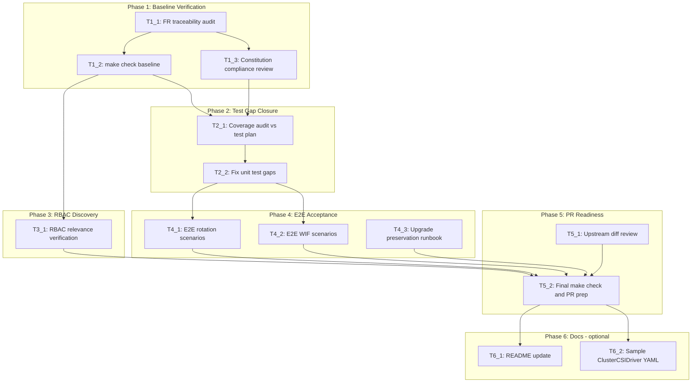

# Execution Backlog
**Feature:** Configurable Secret Rotation and Workload Identity Federation for the Secrets Store CSI Driver
**AgentRoutingMode:** PROVIDED
**ConstitutionVersion:** 1.0.0

**Branch posture:** `repo-assessment.md` §3.1 — **IMPLEMENTED (DELTA)** on commit `0b6b5b3a`. Core implementation (`rotation.go`, `csidriver_asset.go`, `starter.go` wiring, unit tests, extended `hack/e2e.sh`) is already present. This backlog prioritizes **verification, gap closure, and PR readiness** over greenfield authoring.

**Agent roster note:** Derived from `constitution.md` Code Ownership table with provisional IDs where needed:

| Assigned Agent | Constitution area | Key paths |
|---|---|---|
| `ControllerLogic_Agent` | Controller logic | `pkg/operator/*.go`, `go.mod`/`vendor/` |
| `StaticAssets_Agent` | Static assets | `assets/`, `assets/rbac/` |
| `Testing_Agent` | Tests | `pkg/operator/*_test.go`, `hack/e2e.sh` |
| `RBACSecurity_Agent` | Static assets (RBAC review) | `assets/rbac/secretproviderclasses_role.yaml` |
| `OLMRelease_Agent` | OLM / release | PR/upstream diff |
| `Docs_Agent` | Docs | `README.md`, `config/manifests/stable/` |

## 0. Input coverage checklist

- **US1** (P1, rotation on/off) → T1_1, T2_1, T4_1
- **US2** (P1, WIF audiences) → T1_1, T2_1, T4_2
- **US3** (P2, custom interval) → T1_1, T2_1, T4_1
- **US4** (P2, multi-cloud audiences) → T1_1, T2_1, T4_2
- **FR-001–FR-003, FR-011–FR-012** (rotation) → T1_1, T2_1, T4_1
- **FR-004–FR-007, FR-009–FR-010** (WIF + propagation) → T1_1, T2_1, T4_2
- **FR-008** (bounds at admission) → T1_1 (confirm operator does not duplicate CRD validation)
- **SC-001–SC-007** → T2_1, T4_1, T4_2, T4_3, T5_2
- **Plan Phase 1** (baseline verification) → T1_1, T1_2, T1_3
- **Plan Phase 2** (regression hardening) → T2_1, T2_2
- **Plan Phase 3** (RBAC verification) → T3_1
- **Plan Phase 4** (E2E acceptance) → T4_1, T4_2, T4_3
- **Plan Phase 5** (PR readiness) → T5_1, T5_2
- **Plan Phase 6** (optional docs) → T6_1, T6_2
- **Plan §8 #1** (downgrade) → documented in T5_2 / `implementation-report.md`; no code task
- **Plan §8 #2** (upstream diff) → T5_1
- **Plan §8 #3** (RBAC) → T3_1
- **Plan §8 #4** (TechPreview gate) → no task; assume API-server-side only

## 1. Task Dependency Graph (Mermaid)

## 2. Linear Execution Order (Chronological)

1. - [x] T1_1 — FR/SC traceability audit (spec → code → tests)
2. - [x] T1_2 — Run `make check` baseline verification
3. - [x] T1_3 — Constitution compliance review (CA hook, split controller, management state)
4. - [x] T2_1 — Unit/E2E coverage audit against enhancement proposal test plan
5. - [x] T2_2 — Fix unit test gaps (only if T2_1 finds defects)
6. - [x] T3_1 — RBAC `serviceaccounts/token` relevance verification
7. - [x] T4_1 — Execute/verify E2E rotation scenarios (`hack/e2e.sh`)
8. - [x] T4_2 — Execute/verify E2E WIF scenarios (`hack/e2e.sh`)
9. - [x] T4_3 — Upgrade preservation verification (manual runbook or e2e)
10. - [x] T5_1 — Upstream diff review vs `openshift/secrets-store-csi-driver-operator`
11. - [x] T5_2 — Final `make check` and draft PR preparation
12. - [x] T6_1 — README update (optional)
13. - [x] T6_2 — Sample `ClusterCSIDriver` YAML (optional)

## 3. Task Execution Manifest

| Task ID | Task Title | Assigned Agent | Phase | Depends On | Parallel OK | Complexity | Risk |
|---------|-----------|-----------------|-------|-----------|-------------|------------|------|
| T1_1 | FR/SC traceability audit | `ControllerLogic_Agent` | Phase 1 | none | No | 2 | Low |
| T1_2 | `make check` baseline verification | `Testing_Agent` | Phase 1 | T1_1 | No | 1 | Low |
| T1_3 | Constitution compliance review | `ControllerLogic_Agent` | Phase 1 | T1_1 | Yes | 2 | Low |
| T2_1 | Coverage audit vs enhancement test plan | `Testing_Agent` | Phase 2 | T1_2, T1_3 | No | 3 | Med |
| T2_2 | Fix unit test gaps (conditional) | `Testing_Agent` | Phase 2 | T2_1 | No | 3 | Med |
| T3_1 | RBAC relevance verification | `RBACSecurity_Agent` | Phase 3 | T1_2 | Yes | 1 | Low |
| T4_1 | E2E rotation scenarios | `Testing_Agent` | Phase 4 | T2_2 | No | 3 | Med |
| T4_2 | E2E WIF scenarios | `Testing_Agent` | Phase 4 | T2_2 | No | 5 | High |
| T4_3 | Upgrade preservation verification | `Testing_Agent` | Phase 4 | T2_2 | Yes | 3 | Med |
| T5_1 | Upstream diff review | `OLMRelease_Agent` | Phase 5 | T4_1, T4_2 | Yes | 2 | Med |
| T5_2 | Final `make check` and PR prep | `OLMRelease_Agent` | Phase 5 | T4_1, T4_2, T4_3, T5_1, T3_1 | No | 2 | Med |
| T6_1 | README update (optional) | `Docs_Agent` | Phase 6 | T5_2 | Yes | 1 | Low |
| T6_2 | Sample ClusterCSIDriver YAML (optional) | `Docs_Agent` | Phase 6 | T5_2 | Yes | 1 | Low |

## 4. Task Specifications (Payloads)

### Task T1_1: FR/SC traceability audit
- **Objective:** Map every FR-001–FR-012 and SC-001–SC-007 to existing functions, controller wiring, and test cases on branch `0b6b5b3a`. Produce a traceability matrix confirming coverage or flagging gaps for T2_1/T2_2.
- **Target file(s):** `pkg/operator/rotation.go`, `pkg/operator/csidriver_asset.go`, `pkg/operator/starter.go`, `pkg/operator/rotation_test.go`, `pkg/operator/csidriver_asset_test.go`, `hack/e2e.sh` (read-only audit).
- **Non-goals / forbidden edits:** No production code changes in this task unless a critical mapping gap requires immediate fix (escalate to T2_2 instead).
- **Implementation notes:** Confirm `getSecretRotationConfig`, `WithSecretRotationDaemonSetHook`, `getTokenRequests`, `NewDynamicCSIDriverAssetFunc`, split CSIDriver controller, and `optionalInformers` wiring exist per `repo-assessment.md` §3.1.
- **Acceptance criteria:** Written traceability matrix with ≥1 code+test reference per FR; gaps explicitly listed for T2_1. Traces to Plan Phase 1.
- **Downstream handoff:** Gap list for T2_1; compliance baseline for T1_2/T1_3.

### Task T1_2: `make check` baseline verification
- **Objective:** Confirm the branch passes mandatory pre-PR verification (Constitution Principle V).
- **Target file(s):** Whole repo (verification-only).
- **Non-goals / forbidden edits:** Fix only formatting/vet issues surfaced by `make verify`; no feature changes.
- **Implementation notes:** Run `make check` (`make verify` + `make test-unit`). Confirm vendored `openshift/api` includes `SecretsStoreDriverType` at commit `580f1c1ba691`.
- **Acceptance criteria:** `make check` exits 0. Traces to Plan Phase 1 verification hooks.
- **Downstream handoff:** Green baseline for Phases 2–5.

### Task T1_3: Constitution compliance review
- **Objective:** Verify implementation respects Principles I, III, IV, VIII, X: CSIControllerSet hooks only; no custom CRD; `getOperatorSyncState` gating; CA bundle hook preserved; no hand-edited vendor.
- **Target file(s):** `pkg/operator/starter.go` (review).
- **Non-goals / forbidden edits:** Review-first; code changes only if violation found (then route to T2_2).
- **Implementation notes:** Confirm `WithCABundleDaemonSetHook` and `WithSecretRotationDaemonSetHook` both registered; `csidriver.yaml` in separate controller call; `clusterCSIDriverInformer` in `optionalInformers`.
- **Acceptance criteria:** Documented compliance checklist signed off; no Principle violations open. Traces to Constitution Principles I, IV, VIII.
- **Downstream handoff:** Compliance confirmation for T5_2 PR review.

### Task T2_1: Coverage audit vs enhancement test plan
- **Objective:** Compare existing unit tests and `hack/e2e.sh` scenarios against `openspec/inputs/ep.md` Test Plan and `specs.md` acceptance scenarios; identify missing cases.
- **Target file(s):** `pkg/operator/rotation_test.go`, `pkg/operator/csidriver_asset_test.go`, `hack/e2e.sh`.
- **Non-goals / forbidden edits:** Audit-only unless trivial doc comment; implementation fixes go to T2_2.
- **Implementation notes:** Must confirm presence of default-path regression test (`TestDefaultPathMatchesPreFeatureBaseline` or equivalent) for FR-003/FR-012; full tokenRequests preservation matrix; hook missing-container error path.
- **Acceptance criteria:** Audit report listing covered vs missing scenarios; T2_2 skipped if audit finds zero gaps. Traces to Plan Phase 2.
- **Downstream handoff:** Specific test gaps for T2_2, or "no gaps" to unlock E2E.

### Task T2_2: Fix unit test gaps (conditional)
- **Objective:** Add or fix unit tests identified by T2_1 only — do not refactor production code unless a test reveals a defect.
- **Target file(s):** `pkg/operator/rotation_test.go`, `pkg/operator/csidriver_asset_test.go`; production files only if defect proven.
- **Non-goals / forbidden edits:** No unrelated refactors; table-driven tests only per `docs/testing-guidelines.md`.
- **Implementation notes:** If T2_1 reports no gaps, mark task **skipped** with rationale in `implementation/task-reports/T2_2.md`.
- **Acceptance criteria:** `make test-unit` passes; all T2_1 gaps closed or explicitly deferred with SME approval. Traces to FR-001–FR-012 unit coverage.
- **Downstream handoff:** Stable test suite for E2E phase.

### Task T3_1: RBAC relevance verification
- **Objective:** Determine whether `assets/rbac/secretproviderclasses_role.yaml` `serviceaccounts/token: create` is relevant to kubelet-driven `CSIDriver.spec.tokenRequests` (Plan §8 #3).
- **Target file(s):** `assets/rbac/secretproviderclasses_role.yaml` (read-only unless gap found); upstream driver repo (external discovery).
- **Non-goals / forbidden edits:** No speculative RBAC edits (Constitution Principle VI).
- **Implementation notes:** Evidence: PARTIAL — requires upstream driver code review. Document finding in task report; if change needed, add new task before T5_2.
- **Acceptance criteria:** Documented finding: no-change-needed OR specific RBAC YAML change required. Traces to Plan Phase 3.
- **Downstream handoff:** RBAC conclusion for T5_2 and `implementation-report.md`.

### Task T4_1: E2E rotation scenarios
- **Objective:** Run/verify `hack/e2e.sh` rotation tests (`test_rotation_toggle`, `test_rotation_custom_interval`) on live OpenShift 5.0 cluster; confirm SC-001/SC-002.
- **Target file(s):** `hack/e2e.sh` (extend only if scenarios missing per T2_1).
- **Non-goals / forbidden edits:** Do not remove existing baseline secret-mount tests.
- **Implementation notes:** Requires cluster + `oc` + deployed operator. Not runnable in sandbox; verify script structure locally if cluster unavailable.
- **Acceptance criteria:** E2E rotation functions pass on cluster OR documented blocker with reproduction steps. Traces to US1, US3, SC-001, SC-002.
- **Downstream handoff:** E2E rotation status for T5_2.

### Task T4_2: E2E WIF scenarios
- **Objective:** Run/verify WIF e2e tests (single/multi audience, mount continuity); confirm CSIDriver `tokenRequests` propagation (SC-003/SC-004). Full cloud IAM federation is out of scope.
- **Target file(s):** `hack/e2e.sh`.
- **Non-goals / forbidden edits:** No AWS STS/Azure AD round-trip infrastructure in this repo.
- **Implementation notes:** Highest E2E risk — propagation-only verification per `repo-assessment.md` §8.4.
- **Acceptance criteria:** WIF e2e functions pass on cluster; audiences match patched CR. Traces to US2, US4, SC-003, SC-004.
- **Downstream handoff:** E2E WIF status for T5_2.

### Task T4_3: Upgrade preservation verification
- **Objective:** Verify SC-005 — clusters with no `driverConfig.secretsStore` retain defaults; pre-existing manual `tokenRequests` preserved. Manual runbook acceptable if no automated upgrade harness exists.
- **Target file(s):** `hack/e2e.sh` (if upgrade scenario exists); else manual runbook in task report.
- **Non-goals / forbidden edits:** Do not invent full upgrade CI framework.
- **Implementation notes:** Downgrade behavior (Plan §8 #1) explicitly out of scope — upgrade-only.
- **Acceptance criteria:** Documented pass of upgrade-preservation scenario or explicit manual runbook steps. Traces to SC-005, FR-003, FR-005, FR-012.
- **Downstream handoff:** Migration confidence for T5_2.

### Task T5_1: Upstream diff review
- **Objective:** Compare fork branch to `openshift/secrets-store-csi-driver-operator` main; confirm PR scope, commit hygiene, and no unintended files.
- **Target file(s):** Full repo diff (review); `go.mod`/`vendor/` pin validation.
- **Non-goals / forbidden edits:** No CSV version bump unless release team requires (Plan §3.5).
- **Implementation notes:** Resolve Plan §8 #2 — confirm what remains for upstream merge vs already merged.
- **Acceptance criteria:** Written diff summary; PR target branch identified; no surprise unrelated changes. Traces to Plan Phase 5.
- **Downstream handoff:** PR scope for T5_2.

### Task T5_2: Final `make check` and PR prep
- **Objective:** Final verification gate; document known limitations (downgrade, E2E WIF scope); prepare draft PR to fork (`fork_repo_url` in `inputs/jira.yaml`).
- **Target file(s):** Whole repo; `openspec/changes/.../implementation-report.md` (downstream).
- **Non-goals / forbidden edits:** No new features — verification/PR only.
- **Implementation notes:** Run `make check`. Record downgrade as known gap per Plan §8 #1 assumption. Include T3_1 RBAC finding.
- **Acceptance criteria:** `make check` green; draft PR checklist complete; known gaps documented. Traces to Constitution Principle V, Plan Phase 5.
- **Downstream handoff:** Unlocks `/opsx-apply` implementation stage and optional docs tasks.

### Task T6_1: README update (optional)
- **Objective:** Document `driverConfig.secretsStore` configuration and manual verification commands from enhancement proposal Support Procedures.
- **Target file(s):** `README.md`.
- **Non-goals / forbidden edits:** Do not manually edit version strings managed by `hack/update-metadata.sh` (Constitution Principle IX).
- **Implementation notes:** Optional per Plan Phase 6; addresses specs A-004 documentation concern.
- **Acceptance criteria:** README section added with rotation/WIF config examples and `oc get` verification commands.
- **Downstream handoff:** N/A — terminal.

### Task T6_2: Sample ClusterCSIDriver YAML (optional)
- **Objective:** Add sample manifest demonstrating `driverConfig.secretsStore` with rotation + WIF audiences.
- **Target file(s):** New `config/manifests/stable/sscsi-sample-clustercsidriver-secretsstore.yaml`.
- **Non-goals / forbidden edits:** Do not modify existing sample files.
- **Implementation notes:** Follow pattern of existing `sscsi-sample-*.yaml` files.
- **Acceptance criteria:** Valid sample YAML committed; illustrates Managed tokenRequests + Custom rotation.
- **Downstream handoff:** N/A — terminal.

## 5. Orchestration notes (non-code)

### Retry Boundaries
- **T1_1, T1_3, T2_1, T3_1, T5_1** — pure review/discovery; safely retryable with no side effects.
- **T1_2, T2_2, T5_2** — `make check`/`make test-unit` are idempotent; retry after fixing surfaced issues.
- **T4_1–T4_3** — require clean cluster state; retry only after `hack/e2e.sh` teardown restores `ClusterCSIDriver` driverConfig (see script restore helpers).
- **T2_2** — if production code must change due to defect, pair with unit test update in same task iteration; do not wholesale-regenerate `starter.go`.

### Merge Conflict Hotspots
- **`pkg/operator/starter.go`** — only if T2_2 finds defects; otherwise read-only in this backlog.
- **`hack/e2e.sh`** — T4_1, T4_2, T4_3 may extend same file sequentially (`Parallel OK: No` between T4_1 and T4_2).
- **`vendor/`** — no vendor bump expected (API already vendored); never hand-edit (Constitution Principle X).
- **`assets/rbac/`** — only if T3_1 finds RBAC gap requiring new task.

### Open Questions Requiring SME Before Execution
- **Plan §8 #1 (downgrade after Managed):** No implementation task — document in T5_2 / `implementation-report.md` as known limitation. Does not block other tasks.
- **Plan §8 #2 (upstream diff scope):** Resolved by **T5_1** before PR merge.
- **Plan §8 #3 (RBAC relevance):** Resolved by **T3_1**; may spawn ad-hoc RBAC task if gap found.
- **Plan §8 #4 (TechPreview gate):** Assumed API-server-side only; no task unless T5_1 upstream review says otherwise.
- **E2E cluster availability:** T4_1–T4_3 blocked without live OpenShift cluster — document as external dependency in T5_2 if cluster unavailable during `/opsx-apply`.
