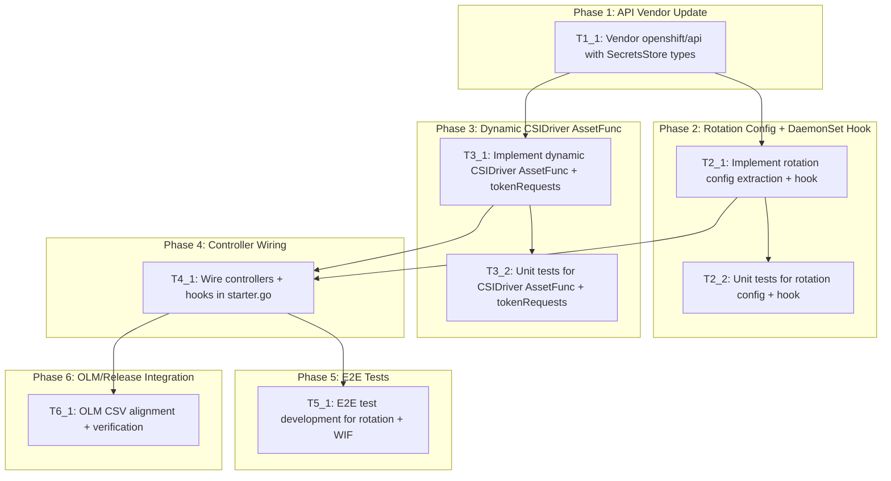

# Execution Backlog
**Feature:** Configurable Secret Rotation and Workload Identity Federation (SSCSI-254)
**AgentRoutingMode:** PROVIDED
**ConstitutionVersion:** 1.0.0

## 0. Input coverage checklist

**Spec FRs → Task coverage:**
- FR-001 (disable rotation): T2_1, T2_2
- FR-002 (custom interval): T2_1, T2_2
- FR-003 (default behavior): T2_1, T2_2
- FR-004 (default custom interval): T2_1, T2_2
- FR-005 (interval validation): T1_1 (CRD-level)
- FR-006 (token audiences): T3_1, T3_2
- FR-007 (max 10 audiences): T1_1 (CRD-level)
- FR-008 (unique audiences): T1_1 (CRD-level)
- FR-009 (expiration validation): T1_1 (CRD-level)
- FR-010 (Managed/Unmanaged): T3_1, T3_2
- FR-011 (preserve existing): T3_1, T3_2
- FR-012 (one-way transition): T1_1 (CEL rule)
- FR-013 (empty audiences clears): T3_1, T3_2
- FR-014 (dynamic DaemonSet): T4_1
- FR-015 (dynamic CSIDriver): T4_1
- FR-016 (no change on upgrade): T2_1, T2_2, T3_1, T3_2
- FR-017 (requiresRepublish lifecycle): T3_1, T3_2
- FR-018 (discriminated unions): T1_1 (CRD-level)

**Spec SCs → Task coverage:**
- SC-001 (disable rotation observable): T5_1
- SC-002 (custom interval observable): T5_1
- SC-003 (token audiences observable): T5_1
- SC-004 (upgrade zero change): T5_1
- SC-005 (preserve existing tokens): T5_1
- SC-006 (invalid config rejected): T1_1 (CRD-level)

**Plan phases → Task coverage:**
- Phase 1 (API Vendor Update): T1_1
- Phase 2 (Rotation Config + DaemonSet Hook): T2_1, T2_2
- Phase 3 (Dynamic CSIDriver AssetFunc): T3_1, T3_2
- Phase 4 (Controller Wiring): T4_1
- Phase 5 (E2E Tests): T5_1
- Phase 6 (OLM/Release): T6_1

## 1. Task Dependency Graph (Mermaid)

## 2. Linear Execution Order (Chronological)

1. T1_1 — Vendor openshift/api with SecretsStore types
2. T2_1 — Implement rotation config extraction + DaemonSet hook
3. T3_1 — Implement dynamic CSIDriver AssetFunc + tokenRequests logic
4. T2_2 — Unit tests for rotation config + DaemonSet hook
5. T3_2 — Unit tests for CSIDriver AssetFunc + tokenRequests
6. T4_1 — Wire controllers + hooks in starter.go
7. T5_1 — E2E test development for rotation + WIF scenarios
8. T6_1 — OLM CSV alignment + verification

## 3. Task Execution Manifest

| Task ID | Task Title | Assigned Agent | Phase | Depends On | Parallel OK | Complexity | Risk |
|---------|-----------|---------------|-------|-----------|------------|-----------|------|
| T1_1 | Vendor openshift/api with SecretsStore types | API_Agent | Phase 1 | none | No | 2 | Low |
| T2_1 | Implement rotation config extraction + DaemonSet hook | OperatorController_Agent | Phase 2 | T1_1 | Yes (with T3_1) | 5 | Med |
| T2_2 | Unit tests for rotation config + DaemonSet hook | Testing_Agent | Phase 2 | T2_1 | Yes (with T3_2) | 5 | Low |
| T3_1 | Implement dynamic CSIDriver AssetFunc + tokenRequests | OperatorController_Agent | Phase 3 | T1_1 | Yes (with T2_1) | 5 | Med |
| T3_2 | Unit tests for CSIDriver AssetFunc + tokenRequests | Testing_Agent | Phase 3 | T3_1 | Yes (with T2_2) | 5 | Low |
| T4_1 | Wire controllers + hooks in starter.go | OperatorController_Agent | Phase 4 | T2_1, T3_1 | No | 3 | Med |
| T5_1 | E2E test development for rotation + WIF scenarios | Testing_Agent | Phase 5 | T4_1 | Yes (with T6_1) | 8 | High |
| T6_1 | OLM CSV alignment + verification | OLMRelease_Agent | Phase 6 | T4_1 | Yes (with T5_1) | 2 | Low |

**Total:** 8 tasks | Complexity points: 35 | High-risk: 1 | Parallelizable pairs: 3

## 4. Task Specifications (Payloads)

### Task T1_1: Vendor openshift/api with SecretsStore types

- **Objective:** Update the vendored `openshift/api` dependency to a commit containing `SecretsStoreDriverType`, `SecretsStoreCSIDriverConfigSpec`, `SecretsStoreSecretRotation`, `SecretsStoreTokenRequests`, `CustomSecretRotation`, `ManagedTokenRequests`, `SecretsStoreTokenRequest`, and related constants/enums.
- **Target file(s):** `go.mod`, `go.sum`, `vendor/github.com/openshift/api/operator/v1/types_csi_driver.go`, `vendor/modules.txt`
- **Non-goals / forbidden edits:** Do not modify any files under `pkg/` or `assets/` in this task. Do not create custom API types in this repo (Constitution Principle III).
- **Implementation notes:** Run `go get github.com/openshift/api@<target-commit> && go mod tidy && go mod vendor`. Verify `opv1.SecretsStoreDriverType` compiles. The target commit must contain all types from the EP's API Extensions section. Currently vendored at `v0.0.0-20260709102940` which includes these types.
- **Acceptance criteria:** `make verify` passes (includes verify-deps). `opv1.SecretsStoreDriverType`, `opv1.SecretRotationNone`, `opv1.SecretRotationCustom`, `opv1.TokenRequestsManaged`, `opv1.TokenRequestsUnmanaged` resolve without compilation errors.
- **Downstream handoff:** Vendored API types available for T2_1 and T3_1.

### Task T2_1: Implement rotation config extraction + DaemonSet hook

- **Objective:** Create `pkg/operator/rotation.go` with: (1) `getSecretRotationConfig` to extract rotation enable/interval from `ClusterCSIDriver.Spec.DriverConfig`, (2) `WithSecretRotationDaemonSetHook` to set `--enable-secret-rotation=` and `--rotation-poll-interval=` on the `csi-driver` container, (3) helpers `setArg` and `formatRotationInterval`.
- **Target file(s):** `pkg/operator/rotation.go`
- **Non-goals / forbidden edits:** Do not modify `starter.go` (wiring is T4_1). Do not modify `assets/node.yaml` static defaults. Do not duplicate CEL validation logic from the CRD schema.
- **Implementation notes:**
  - `getSecretRotationConfig` must handle the full nil-safety matrix: driverType != SecretsStore → defaults; secretsStore zero value → defaults; secretRotation zero value → defaults; type None → disabled; type Custom with/without minimumRefreshAge.
  - Default values: `defaultRotationEnabled = true`, `defaultRotationPollInterval = 2 * time.Minute`, `defaultCustomRefreshInterval = 120 * time.Second`.
  - `formatRotationInterval` must render whole-minute durations as `Nm` (not Go's `NmOs`) to avoid unintended DaemonSet rollouts on upgrade (FR-003/FR-016).
  - `WithSecretRotationDaemonSetHook` closes over a `cache.GenericLister` (the existing dynamic informer) and converts unstructured → typed `opv1.ClusterCSIDriver`. Returns nil on NotFound (leaves static defaults).
  - Error when `csi-driver` container not found in DaemonSet.
- **Acceptance criteria:** FR-001, FR-002, FR-003, FR-004, FR-016. The hook must produce byte-for-byte identical args to `node.yaml` baseline for unconfigured clusters. Traces to specs.md US-1, US-2, US-5 edge cases.
- **Downstream handoff:** `getSecretRotationConfig` and `WithSecretRotationDaemonSetHook` available for T2_2 (tests) and T4_1 (wiring).

### Task T2_2: Unit tests for rotation config + DaemonSet hook

- **Objective:** Create `pkg/operator/rotation_test.go` with comprehensive table-driven tests covering: `TestSetArg` (4 cases), `TestGetSecretRotationConfig` (6 cases: nil, non-SecretsStore, SecretsStore nil, zero value, type None, type Custom with/without interval), `TestWithSecretRotationDaemonSetHook` (4 cases + missing container), `TestCABundleAndRotationHooksCoexist` (Constitution Principle VIII), `TestDefaultPathMatchesPreFeatureBaseline` (FR-003/FR-016 regression).
- **Target file(s):** `pkg/operator/rotation_test.go`
- **Non-goals / forbidden edits:** Do not modify production code. Do not use assertion libraries (standard `if` + `t.Fatalf`/`t.Errorf` per AGENTS.md). Do not use third-party mocking frameworks.
- **Implementation notes:**
  - Use `newFakeClusterCSIDriverLister` helper (cache.NewIndexer → cache.NewGenericLister) for the dynamic lister.
  - Use `newTestDaemonSet` helper matching `node.yaml` baseline args.
  - The coexistence test applies both CA bundle and rotation hooks in registration order and verifies neither clobbers the other.
  - The baseline regression test verifies byte-for-byte match with `node.yaml` static defaults.
- **Acceptance criteria:** `make test-unit` passes. All nil-safety paths exercised. Pre-feature baseline regression test present and passing.
- **Downstream handoff:** Tests validate T2_1 correctness. No downstream dependencies.

### Task T3_1: Implement dynamic CSIDriver AssetFunc + tokenRequests logic

- **Objective:** Create `pkg/operator/csidriver_asset.go` with: (1) `getRequiresRepublish` mirroring rotation enabled state, (2) `getTokenRequests` with full preservation matrix, (3) `NewDynamicCSIDriverAssetFunc` rendering `csidriver.yaml` with dynamic `requiresRepublish` and `tokenRequests`, (4) `stringValue` helper.
- **Target file(s):** `pkg/operator/csidriver_asset.go`
- **Non-goals / forbidden edits:** Do not modify `starter.go` (wiring is T4_1). Do not modify `assets/csidriver.yaml`. Do not re-implement CEL validation (tokenRequests immutability is CRD-level).
- **Implementation notes:**
  - `getTokenRequests` preservation matrix: driverType != SecretsStore → preserve; secretsStore zero → preserve; tokenRequests zero → preserve; Unmanaged → preserve; Managed with nil audiences → preserve (defensive); Managed with non-nil audiences → map to `[]storagev1.TokenRequest`; Managed with `&[]{}` → return empty slice (clears all).
  - `Audiences` is `*[]T` — nil means "omitted" (preserve), non-nil pointer to empty slice means "explicitly clear".
  - `NewDynamicCSIDriverAssetFunc` wraps `namespaceAssetFunc`, reads base manifest via `resourceread.ReadCSIDriverV1OrDie`, reads live CSIDriver for existing tokenRequests, reads ClusterCSIDriver for config, mutates, marshals back to YAML.
  - On ClusterCSIDriver NotFound: return unmutated base manifest (no requiresRepublish, no tokenRequests).
- **Acceptance criteria:** FR-006, FR-010, FR-011, FR-013, FR-015, FR-017. tokenRequests preserved at every nil-check level. Empty audiences explicitly clears. Traces to specs.md US-3, US-4, US-5.
- **Downstream handoff:** `NewDynamicCSIDriverAssetFunc` and `getRequiresRepublish`/`getTokenRequests` available for T3_2 (tests) and T4_1 (wiring).

### Task T3_2: Unit tests for CSIDriver AssetFunc + tokenRequests

- **Objective:** Create `pkg/operator/csidriver_asset_test.go` with table-driven tests: `TestGetRequiresRepublish` (3 cases), `TestGetTokenRequests` (8 cases covering full preservation matrix including explicit empty), `TestNewDynamicCSIDriverAssetFunc` (4+ cases including existing tokenRequests preservation, type None, no ClusterCSIDriver).
- **Target file(s):** `pkg/operator/csidriver_asset_test.go`
- **Non-goals / forbidden edits:** Do not modify production code. Standard testing patterns only (no assertion libs, no mocking frameworks).
- **Implementation notes:**
  - Use `newFakeCSIDriverLister` helper (`storagelistersv1.NewCSIDriverLister` backed by in-memory indexer).
  - Reuse `newFakeClusterCSIDriverLister` from rotation_test.go (same package).
  - The explicit-empty test must verify a non-nil, zero-length slice is returned (not nil).
  - AssetFunc tests must verify base manifest fields (name, attachRequired) survive the round-trip.
- **Acceptance criteria:** `make test-unit` passes. All 8 tokenRequests preservation paths exercised. AssetFunc round-trip preserves base manifest fields.
- **Downstream handoff:** Tests validate T3_1 correctness. No downstream dependencies.

### Task T4_1: Wire controllers + hooks in starter.go

- **Objective:** Update `pkg/operator/starter.go` to: (1) split `csidriver.yaml` into its own `ConditionalStaticResourcesController` ("SecretsStoreDynamicCSIDriverController") with `NewDynamicCSIDriverAssetFunc`, (2) register `WithSecretRotationDaemonSetHook` alongside existing `WithCABundleDaemonSetHook`, (3) pass `clusterCSIDriverInformer` as optional informer to `WithCSIDriverNodeService` for immediate re-sync, (4) create CSIDriver lister from `kubeInformersForNamespaces.InformersFor("").Storage().V1().CSIDrivers()`.
- **Target file(s):** `pkg/operator/starter.go`
- **Non-goals / forbidden edits:** Do not create new informer factories (reuse existing `dynamicInformers` and `kubeInformersForNamespaces`). Do not remove or modify the CA bundle hook (Constitution Principle VIII). Do not add cluster-wide informers (AGENTS.md pitfall).
- **Implementation notes:**
  - The dynamic CSIDriver controller must use the same `getOperatorSyncState` gating as the static resources controller (Constitution Principle IV).
  - The `clusterCSIDriverInformer` is obtained from `dynamicInformers.ForResource(gvr)` — the same factory already created for the operator client.
  - Hooks are registered as variadic args to `WithCSIDriverNodeService`: CA bundle first, rotation second (matching the coexistence test order).
- **Acceptance criteria:** FR-014, FR-015. `make check` passes. Controller chain follows Constitution Principles I, IV, VIII. No new informer factories.
- **Downstream handoff:** Fully wired operator available for T5_1 (E2E) and T6_1 (OLM).

### Task T5_1: E2E test development for rotation + WIF scenarios

- **Objective:** Develop E2E tests covering the scenarios from specs.md and the EP's Test Plan: rotation defaults, Custom interval, None (disabled), toggle, tokenRequests Unmanaged/Managed/empty/multi-audience, and upgrade scenarios (no driverConfig, pre-existing tokenRequests preservation).
- **Target file(s):** `hack/e2e.sh` or E2E test files (Evidence: PARTIAL — E2E test structure for this feature not confirmed on branch; discovery step: check existing e2e patterns before writing)
- **Non-goals / forbidden edits:** Do not modify production operator code. Do not modify unit tests.
- **Implementation notes:**
  - E2E tests run via `make test-e2e` which calls `hack/e2e.sh`. Requires a live OpenShift cluster and `openshift-tests` in PATH.
  - Test scenarios should verify observable outcomes: DaemonSet args via `oc get ds ... -o jsonpath`, CSIDriver spec via `oc get csidriver ... -o yaml`, operator status conditions.
  - Upgrade scenarios should test: minimal CR (no driverConfig) → verify defaults; CR with pre-existing manually-patched tokenRequests → verify preservation.
  - Multi-cloud scenario: configure AWS + Azure audiences → verify both in CSIDriver.spec.tokenRequests.
- **Acceptance criteria:** SC-001 through SC-005. E2E scenarios from specs.md §Test Plan are exercised. `make test-e2e` passes on a live cluster (CI validation).
- **Downstream handoff:** E2E coverage enables release confidence. No downstream task dependencies.

### Task T6_1: OLM CSV alignment + verification

- **Objective:** Verify that the OLM ClusterServiceVersion at `config/manifests/stable/` has correct RBAC permissions for the dynamic CSIDriver controller. Verify image references are consistent. Run `hack/update-metadata.sh` if OCP version bump is required.
- **Target file(s):** `config/manifests/stable/*.clusterserviceversion.yaml`, `config/manifests/stable/image-references` (Evidence: PARTIAL — not read in repo-assessment)
- **Non-goals / forbidden edits:** Do not modify operator Go code. Do not change OLM channel structure.
- **Implementation notes:**
  - The dynamic CSIDriver controller uses `kubeClient` (already has CSIDriver CRUD permissions via existing CSV RBAC) and `clusterCSIDriverLister` (read-only via dynamic informer). Verify no additional RBAC rules are needed.
  - If the operator already has `storage.k8s.io/v1/csidrivers` verbs `get,list,watch,create,update,delete` in the CSV, no change is needed.
  - Run `make metadata` if version needs bumping.
- **Acceptance criteria:** CSV RBAC covers all resources the operator manages. `make verify` passes after any changes. Constitution Principle IX satisfied.
- **Downstream handoff:** OLM bundle ready for release. No downstream dependencies.

## 5. Orchestration notes (non-code)

### Retry Boundaries

- **T1_1 (vendor update):** Safe to retry. Idempotent (`go mod tidy && go mod vendor`). Failure mode: upstream openshift/api commit not available → wait for API PR merge.
- **T2_1, T3_1 (implementation):** Safe to retry independently. These touch disjoint files (`rotation.go` vs `csidriver_asset.go`) and can be retried without affecting each other.
- **T2_2, T3_2 (unit tests):** Safe to retry. Test files are self-contained within the `operator` package.
- **T4_1 (wiring):** Safe to retry but must be re-validated after any change to T2_1 or T3_1 (function signatures).
- **T5_1 (E2E):** Requires live cluster. Failures may be environmental (cluster state, flaky tests) rather than code bugs. Retry with fresh cluster state.
- **T6_1 (OLM):** Safe to retry. Primarily inspection/verification.

### Merge Conflict Hotspots

- **`pkg/operator/starter.go`:** High conflict risk — this file is the central wiring point. T4_1 modifies it and any concurrent upstream changes to the CSIControllerSet chain will conflict. Mitigation: rebase before and after T4_1.
- **`go.mod` / `go.sum` / `vendor/`:** T1_1 modifies these. Any concurrent dependency update will conflict. Mitigation: vendor update should be the first commit; rebase frequently.
- **No `zz_generated` or bindata files** in this repo — no code generation conflict risk.

### Open Questions Requiring SME Before Execution

None — all decisions resolved in the plan. The feature is implemented on the pinned branch. Tasks document the approach taken and identify verification gaps.
