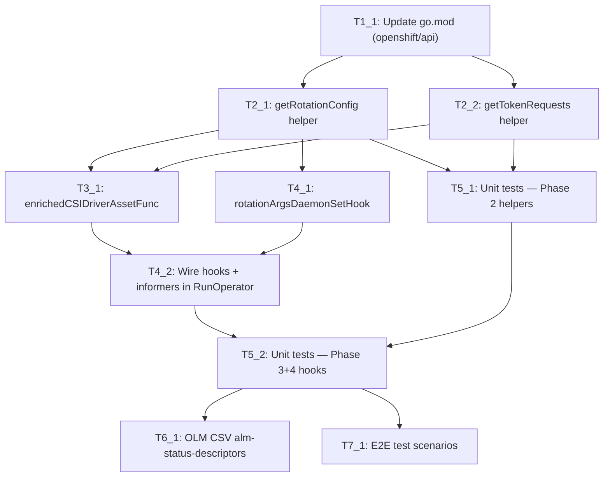

# Execution Backlog
**Feature:** SSCSI-254 — Configurable Secret Rotation and Workload Identity Federation
**AgentRoutingMode:** PROVIDED
**ConstitutionVersion:** 1.0

---

## 0. Input Coverage Checklist

| Spec requirement | Plan phase | Covering task(s) |
|-----------------|-----------|-----------------|
| FR-001 Disable rotation | Phase 2, 4 | T2_1, T4_1, T4_2 |
| FR-002 Configure minimum refresh age | Phase 2, 4 | T2_1, T4_1 |
| FR-003 Propagate to driver container args | Phase 4 | T4_1, T4_2 |
| FR-004 Propagate to CSIDriver requiresRepublish | Phase 2, 3 | T2_1, T3_1, T4_2 |
| FR-005 Configure token audiences for WIF | Phase 2, 3 | T2_2, T3_1, T4_2 |
| FR-006 Multiple token audiences simultaneously | Phase 2, 3 | T2_2, T3_1 |
| FR-007 Preserve existing tokenRequests (Unmanaged) | Phase 2, 3 | T2_2, T3_1 |
| FR-008 Managed policy immutable (CEL) | Phase 1 | T1_1 (openshift/api enforces) |
| FR-009 Built-in defaults match pre-upgrade | Phase 2 | T2_1, T2_2 |
| FR-010 Validate rotation interval (CEL) | Phase 1 | T1_1 (openshift/api enforces) |
| FR-011 Validate token expiration (CEL) | Phase 1 | T1_1 (openshift/api enforces) |
| FR-012 Degraded status on failure | Phase 3, 4 | T3_1, T4_1 (library-go handles automatically) |
| SC-001 Rotation disabled stops provider calls | Phase 4, 7 | T4_1, T4_2, T7_1 |
| SC-002 Token audiences enable WIF | Phase 3, 7 | T3_1, T4_2, T7_1 |
| SC-003 Custom interval respected | Phase 2, 4, 7 | T2_1, T4_1, T7_1 |
| SC-004 Multiple audiences active simultaneously | Phase 3, 7 | T3_1, T7_1 |
| SC-005 Invalid config rejected at admission | Phase 1 | T1_1 (openshift/api CEL) |
| SC-006 Upgrade: no behavior change | Phase 2, 3, 4, 7 | T2_1, T2_2, T3_1, T7_1 |
| SC-007 Adopt managed tokenRequests post-upgrade | Phase 3, 7 | T3_1, T7_1 |
| Plan Phase 1 (API dependency) | Phase 1 | T1_1 |
| Plan Phase 2 (extraction helpers) | Phase 2 | T2_1, T2_2 |
| Plan Phase 3 (dynamic AssetFunc) | Phase 3 | T3_1 |
| Plan Phase 4 (DaemonSet hook + wiring) | Phase 4 | T4_1, T4_2 |
| Plan Phase 5 (unit tests) | Phase 5 | T5_1, T5_2 |
| Plan Phase 6 (OLM/CSV) | Phase 6 | T6_1 |
| Plan Phase 7 (E2E tests) | Phase 7 | T7_1 |

---

## 1. Task Dependency Graph (Mermaid)



---

## 2. Linear Execution Order (Chronological)

1. T1_1 — Update go.mod for openshift/api PR #2846
2. T2_1 — Implement getRotationConfig helper
3. T2_2 — Implement getTokenRequests helper
4. T3_1 — Implement enrichedCSIDriverAssetFunc
5. T4_1 — Implement rotationArgsDaemonSetHook
6. T4_2 — Wire hooks and replace nil informers in RunOperator
7. T5_1 — Unit tests for Phase 2 helpers
8. T5_2 — Unit tests for Phase 3+4 hooks
9. T6_1 — OLM CSV alm-status-descriptors update
10. T7_1 — E2E test scenarios

---

## 3. Task Execution Manifest

| Task ID | Task Title | Assigned Agent | Phase | Depends On | Parallel OK | Complexity | Risk |
|---------|-----------|---------------|-------|-----------|------------|-----------|------|
| T1_1 | Update go.mod for openshift/api PR #2846 | OperatorController_Agent | 1 | — | No | 2 | High (external blocker) |
| T2_1 | Implement getRotationConfig helper | OperatorController_Agent | 2 | T1_1 | No | 2 | Low |
| T2_2 | Implement getTokenRequests helper | OperatorController_Agent | 2 | T1_1 | No | 3 | Medium (live cluster read) |
| T3_1 | Implement enrichedCSIDriverAssetFunc | OperatorController_Agent | 3 | T2_1, T2_2 | No | 3 | Medium (hash change on upgrade) |
| T4_1 | Implement rotationArgsDaemonSetHook | OperatorController_Agent | 4 | T2_1 | No | 2 | Low |
| T4_2 | Wire hooks and replace nil informers in RunOperator | OperatorController_Agent | 4 | T3_1, T4_1 | No | 2 | Low |
| T5_1 | Unit tests — Phase 2 helpers (getRotationConfig, getTokenRequests) | Testing_Agent | 5 | T2_1, T2_2 | No | 3 | Low |
| T5_2 | Unit tests — Phase 3+4 hooks (AssetFunc, DaemonSet hook) | Testing_Agent | 5 | T4_2, T5_1 | No | 3 | Low |
| T6_1 | OLM CSV alm-status-descriptors update | OLMRelease_Agent | 6 | T5_2 | Yes (with T7_1) | 1 | Low |
| T7_1 | E2E test scenarios | Testing_Agent | 7 | T5_2 | Yes (with T6_1) | 5 | Medium (live cluster) |

---

## 4. Task Specifications (Payloads)

---

### Task T1_1: Update go.mod for openshift/api PR #2846

- **Objective:** Ensure `go.mod` references the version of `github.com/openshift/api` that includes the `SecretsStore` discriminated union in `CSIDriverConfigSpec`. Verify `go build ./...` compiles cleanly against the new types. Confirm `pkg/operator/starter.go` can reference `ClusterCSIDriver.Spec.DriverConfig.SecretsStore` without error.
- **Target file(s):** `go.mod`, `go.sum`
- **Non-goals / forbidden edits:** Do not modify any `.go` source files in this task. Do not introduce a `replace` directive in the final version unless explicitly instructed by the team — it must be removed before merge.
- **Implementation notes:**
  - If PR #2846 is not yet merged: use `go mod edit -replace github.com/openshift/api=<local-or-fork-path>` during development. Remove before final PR.
  - Run `go mod tidy` after updating the version pinning.
  - Verify RBAC: confirm the operator's service account already has `get` on `csidrivers` resource (expected from current `resourceapply.ApplyCSIDriver` usage). Document conclusion in a comment.
- **Acceptance criteria:**
  - `go build ./...` passes with the new openshift/api version
  - `make check` green (no regressions on existing unit suite)
  - The type `opv1.ClusterCSIDriver.Spec.DriverConfig` resolves in the Go compiler without errors
- **Downstream handoff:** Updated `go.mod` + `go.sum`. Downstream tasks (T2_1, T2_2) can now reference new API types.

---

### Task T2_1: Implement getRotationConfig Helper

- **Objective:** Add a new private function `getRotationConfig` to `pkg/operator/starter.go` that reads `ClusterCSIDriver.spec.driverConfig.secretsStore.secretRotation` and returns the concrete rotation configuration: `(requiresRepublish bool, enableRotation bool, pollInterval string)`. Must apply built-in defaults at every nil level.
- **Target file(s):** `pkg/operator/starter.go`
- **Non-goals / forbidden edits:** Do not modify `RunOperator`, `replaceNamespaceFunc`, `getOperatorSyncState`, or `extractOperatorSpec`. Do not add this function to a new file.
- **Implementation notes:**
  - Nil-handling chain (all branches must return same built-in defaults `true, true, "2m"`):
    - `DriverType != SecretsStore` (or empty) → built-in defaults
    - `SecretsStore == nil` → built-in defaults
    - `SecretRotation` zero-value → built-in defaults
    - `SecretRotation.type == None` → `false, false, "2m"` (rotation off; interval unused but keep default)
    - `SecretRotation.type == Custom`, `MinimumRefreshAge == 0` → `true, true, "2m"` (default interval)
    - `SecretRotation.type == Custom`, `MinimumRefreshAge > 0` → `true, true, fmt.Sprintf("%dm%ds", ...)` formatted as Go duration string (e.g., 300 → `"5m0s"`)
  - `requiresRepublish` mapping: `false` only when `type == None`; `true` for all other states (absent, Custom)
  - Read operator state via `operatorClient.GetOperatorState()` — already used by `getOperatorSyncState`
  - No new imports needed (all types available from existing go.mod)
- **Acceptance criteria:**
  - Function signature: `func getRotationConfig(operatorClient v1helpers.OperatorClientWithFinalizers) (requiresRepublish bool, enableRotation bool, pollInterval string)`
  - All nil-path permutations return correct defaults (verified by T5_1 unit tests)
  - `go build ./... && go vet ./...` passes
- **Downstream handoff:** `getRotationConfig` available for T3_1 (AssetFunc) and T4_1 (DaemonSet hook).

---

### Task T2_2: Implement getTokenRequests Helper

- **Objective:** Add a new private function `getTokenRequests` to `pkg/operator/starter.go` that reads `ClusterCSIDriver.spec.driverConfig.secretsStore.tokenRequests` and returns `[]storagev1.TokenRequest`. Implements the Unmanaged-default preservation of existing live `CSIDriver.spec.tokenRequests`.
- **Target file(s):** `pkg/operator/starter.go`
- **Non-goals / forbidden edits:** Do not modify `RunOperator` wiring in this task (that is T4_2). Do not add this to a new file.
- **Implementation notes:**
  - Nil-handling chain:
    - `DriverType != SecretsStore` or `SecretsStore == nil` or `TokenRequests` zero-value → read live CSIDriver via `dynamicClient.Resource(csiDriverGVR).Get(ctx, providerName, ...)`, extract `spec.tokenRequests`, return converted `[]storagev1.TokenRequest`. Return `nil` (not error) if CSIDriver does not exist yet.
    - `TokenRequests.Type == Unmanaged` → same live-read behavior as above
    - `TokenRequests.Type == Managed` → convert `TokenRequests.Managed.Audiences` list to `[]storagev1.TokenRequest{Audience: aud.Audience, ExpirationSeconds: &aud.ExpirationSeconds}`. Empty audiences list → return empty (not nil) slice to explicitly clear tokenRequests.
  - Function signature: `func getTokenRequests(ctx context.Context, operatorClient v1helpers.OperatorClientWithFinalizers, dynamicClient dynamic.Interface) ([]storagev1.TokenRequest, error)`
  - The `dynamicClient` is already created in `RunOperator` — it will be passed through to this function by the closure in T3_1.
  - Import `storagev1 "k8s.io/api/storage/v1"` (add to imports block)
- **Acceptance criteria:**
  - All nil-path permutations return correct tokenRequests (verified by T5_1 unit tests)
  - Unmanaged path: live CSIDriver read returns existing tokenRequests
  - Managed path: audiences list is converted correctly; empty audiences → empty slice
  - `go build ./... && go vet ./...` passes
- **Downstream handoff:** `getTokenRequests` available for T3_1 (AssetFunc enrichment).

---

### Task T3_1: Implement enrichedCSIDriverAssetFunc

- **Objective:** Add `enrichedCSIDriverAssetFunc` to `pkg/operator/starter.go` — a factory function that returns a `resourceapply.AssetFunc`. For the `"csidriver.yaml"` asset it enriches the base manifest with `requiresRepublish` and `tokenRequests` from `ClusterCSIDriver`; for all other assets it delegates to `replaceNamespaceFunc` unchanged.
- **Target file(s):** `pkg/operator/starter.go`
- **Non-goals / forbidden edits:** Do not modify `assets/csidriver.yaml` on disk — enrichment is in-memory only. Do not modify `replaceNamespaceFunc`. Do not wire into `RunOperator` in this task (that is T4_2).
- **Implementation notes:**
  - Function signature: `func enrichedCSIDriverAssetFunc(operatorClient v1helpers.OperatorClientWithFinalizers, dynamicClient dynamic.Interface, namespace string) resourceapply.AssetFunc`
  - Returns a closure:
    1. If `name != "csidriver.yaml"`: return `replaceNamespaceFunc(namespace)(name)` — identical to current behavior
    2. If `name == "csidriver.yaml"`:
       a. `bytes, err := assets.ReadFile("csidriver.yaml")` — read base YAML
       b. `obj := resourceread.ReadCSIDriverV1OrDie(bytes)` — deserialize to typed `storagev1.CSIDriver`
       c. Call `getRotationConfig(operatorClient)` → set `obj.Spec.RequiresRepublish = &requiresRepublish`
       d. Call `getTokenRequests(ctx, operatorClient, dynamicClient)` → set `obj.Spec.TokenRequests = tokenRequests`
       e. Serialize back to JSON bytes via `json.Marshal(obj)` or `runtime.Encode`
  - Import `resourceread "github.com/openshift/library-go/pkg/operator/resource/resourceread"` (verify this path in go.mod — PARTIAL evidence; confirm package exists)
  - On `getTokenRequests` error: return the error directly — `ConditionalStaticResourcesController` will set Degraded condition (FR-012 satisfied automatically by library-go)
- **Acceptance criteria:**
  - For `"csidriver.yaml"`: returned bytes deserialize to `storagev1.CSIDriver` with correct `requiresRepublish` and `tokenRequests` fields for all config combinations
  - For non-CSIDriver assets: `${NAMESPACE}` substitution applied, no other changes
  - `go build ./... && go vet ./...` passes
- **Downstream handoff:** `enrichedCSIDriverAssetFunc` ready for wiring in T4_2.

---

### Task T4_1: Implement rotationArgsDaemonSetHook

- **Objective:** Add `rotationArgsDaemonSetHook` to `pkg/operator/starter.go` — a factory function returning a `csidrivernodeservicecontroller.DaemonSetHookFunc` that sets `--enable-secret-rotation` and `--rotation-poll-interval` on the `csi-driver` container.
- **Target file(s):** `pkg/operator/starter.go`
- **Non-goals / forbidden edits:** Do not modify `assets/node.yaml` container arg baseline. Do not wire into `RunOperator` in this task (that is T4_2).
- **Implementation notes:**
  - Function signature: `func rotationArgsDaemonSetHook(operatorClient v1helpers.OperatorClientWithFinalizers) csidrivernodeservicecontroller.DaemonSetHookFunc`
  - Returns a closure that:
    1. Calls `getRotationConfig(operatorClient)` → `_, enableRotation, pollInterval`
    2. Finds the container named `"csi-driver"` in `spec.template.spec.containers` by iterating and matching `container.Name`. Returns `fmt.Errorf("csi-driver container not found in DaemonSet")` if not found.
    3. Replaces args by prefix match: find and replace the element starting with `"--enable-secret-rotation="`, replace with `fmt.Sprintf("--enable-secret-rotation=%v", enableRotation)`. Same for `"--rotation-poll-interval="`.
    4. If an arg is not found (e.g., first reconcile on a fresh cluster), append it.
  - `csidrivernodeservicecontroller.DaemonSetHookFunc` signature: `func(*appsv1.DaemonSet) error`
  - The `requiresRepublish` value is NOT used here — it is applied in T3_1 to the CSIDriver object, not the DaemonSet.
- **Acceptance criteria:**
  - Hook correctly sets both args when rotation is enabled with custom interval
  - Hook correctly sets `false` for both when rotation is disabled
  - Hook returns error when `csi-driver` container is not found
  - No other containers or args are modified
  - `go build ./... && go vet ./...` passes
- **Downstream handoff:** `rotationArgsDaemonSetHook` ready for wiring in T4_2.

---

### Task T4_2: Wire Hooks and Replace nil Informers in RunOperator

- **Objective:** Update `RunOperator` in `pkg/operator/starter.go` to use the new functions from T3_1 and T4_1, and to wire `dynamicInformers` so `ClusterCSIDriver` changes trigger immediate DaemonSet reconciliation.
- **Target file(s):** `pkg/operator/starter.go` (modifications to `RunOperator` function body only)
- **Non-goals / forbidden edits:** Do not modify the helper functions implemented in T2_1, T2_2, T3_1, T4_1. Do not change informer startup or the `csiControllerSet.Run` call. Do not add a new controller to the chain.
- **Implementation notes:**
  - Replace `replaceNamespaceFunc(operatorNamespace)` in `WithConditionalStaticResourcesController` with `enrichedCSIDriverAssetFunc(operatorClient, dynamicClient, operatorNamespace)`
  - In `WithCSIDriverNodeService`:
    - Replace `nil` (the optional informers argument) with `dynamicInformers` — so ClusterCSIDriver changes trigger DaemonSet reconciliation
    - Add `rotationArgsDaemonSetHook(operatorClient)` as a second variadic hook argument (after the existing `csidrivernodeservicecontroller.WithCABundleDaemonSetHook(...)`)
  - The `ctx` variable is available in `RunOperator` scope; pass it to closures that call `getTokenRequests`
  - No new informers to start — `dynamicInformers` is already started via `go dynamicInformers.Start(ctx.Done())`
- **Acceptance criteria:**
  - `RunOperator` compiles and `go build ./...` passes
  - `make check` passes (verify + unit suite)
  - Wiring review: `WithConditionalStaticResourcesController` receives `enrichedCSIDriverAssetFunc`; `WithCSIDriverNodeService` receives `dynamicInformers` and two hooks (CA bundle + rotation args)
- **Downstream handoff:** Complete functional implementation. T5_1, T5_2 can now write tests against all functions.

---

### Task T5_1: Unit Tests — Phase 2 Helpers (getRotationConfig, getTokenRequests)

- **Objective:** Write comprehensive unit tests for `getRotationConfig` and `getTokenRequests` covering all nil-path permutations and config combinations. Must reach the coverage level specified in `repo-assessment.md §8.4`.
- **Target file(s):** `pkg/operator/starter_test.go`
- **Non-goals / forbidden edits:** Do not modify `starter.go`. Do not use counterfeiter or gomock. Do not import testify.
- **Implementation notes:**
  - Follow the existing `TestGetOperatorSyncState` pattern: `FakeOperator` struct + `v1helpers.NewFakeOperatorClientWithObjectMeta` + table-driven + `t.Run` + `t.Fatalf`
  - For `getTokenRequests` Unmanaged path: mock the dynamic client with a fake that returns a pre-populated `CSIDriver` object — use the unstructured client fake from `k8s.io/client-go/dynamic/fake`
  - Required test cases for `getRotationConfig`:
    - nil driverConfig → defaults (true, true, "2m")
    - nil secretsStore → defaults
    - type None → (false, false, "2m")
    - type Custom, minimumRefreshAge=0 → (true, true, "2m")
    - type Custom, minimumRefreshAge=300 → (true, true, "5m0s")
  - Required test cases for `getTokenRequests`:
    - nil driverConfig + existing live CSIDriver tokenRequests → existing returned
    - type Unmanaged + existing → existing returned
    - type Managed + audiences list → correct storagev1.TokenRequest slice
    - type Managed + empty audiences → empty (non-nil) slice
    - nil driverConfig + no live CSIDriver → nil returned (no error)
- **Acceptance criteria:**
  - `go test ./pkg/... ./cmd/... -v -count=1 -run TestGetRotationConfig` passes
  - `go test ./pkg/... ./cmd/... -v -count=1 -run TestGetTokenRequests` passes
  - All test cases from inventory pass
- **Downstream handoff:** T5_2 can be started once T5_1 is green.

---

### Task T5_2: Unit Tests — Phase 3+4 Hooks (enrichedCSIDriverAssetFunc, rotationArgsDaemonSetHook)

- **Objective:** Write unit tests for `enrichedCSIDriverAssetFunc` and `rotationArgsDaemonSetHook` covering all output combinations and error paths. Also run `make check` to confirm the full test suite and verification pass.
- **Target file(s):** `pkg/operator/starter_test.go`
- **Non-goals / forbidden edits:** Do not modify `starter.go`. Do not modify `assets/csidriver.yaml`.
- **Implementation notes:**
  - For `enrichedCSIDriverAssetFunc`:
    - Test: rotation enabled, no tokenRequests → `csidriver.yaml` bytes deserialize to CSIDriver with `requiresRepublish=true`, no tokenRequests
    - Test: rotation disabled → `requiresRepublish=false`, `--enable-secret-rotation` not set (CSIDriver only, not DaemonSet)
    - Test: Managed tokenRequests with two audiences → `CSIDriver.spec.tokenRequests` has both entries
    - Test: non-CSIDriver asset (e.g., `"node_sa.yaml"`) → `${NAMESPACE}` substitution applied, no enrichment
  - For `rotationArgsDaemonSetHook`:
    - Test: rotation enabled, custom interval → both args set correctly in `csi-driver` container
    - Test: rotation disabled → both args set to `false`/`"2m"` (interval keeps default)
    - Test: `csi-driver` container not found → hook returns error
    - Test: no matching arg prefix (first reconcile, arg not present) → arg appended
  - After all tests pass, run `make check` as the integration signal
- **Acceptance criteria:**
  - All hook unit tests pass
  - `make check` (= `make verify` + `make test-unit`) exits 0
  - No regressions in `TestGetOperatorSyncState`
- **Downstream handoff:** Implementation + unit tests complete. T6_1 and T7_1 can proceed.

---

### Task T6_1: OLM CSV alm-status-descriptors Update

- **Objective:** Update the OLM CSV to add `alm-status-descriptors` entries for the new `secretRotation` and `tokenRequests` configurable fields, making them visible in the OLM console UI.
- **Target file(s):** `config/manifests/stable/*.clusterserviceversion.yaml`
- **Non-goals / forbidden edits:** Do not change `spec.version`, `spec.replaces`, `olm.skipRange`, or `relatedImages`. Do not run `make metadata` to bump the OCP version — this is a descriptor-only change.
- **Implementation notes:**
  - Add entries under `metadata.annotations.alm-examples` and/or `spec.customresourcedefinitions.owned[].specDescriptors` for:
    - `spec.driverConfig.secretsStore.secretRotation` — displayName, description, x-descriptors
    - `spec.driverConfig.secretsStore.tokenRequests` — displayName, description
  - Follow the existing pattern for other CSI driver types in the same CSV (e.g., AWS, Azure) as formatting reference
  - After edit: `go build ./...` to confirm no compile regressions from YAML change (embed is not affected by config/ directory)
- **Acceptance criteria:**
  - CSV YAML is valid (parseable)
  - `make metadata` runs without error (no version drift)
  - `go build ./...` passes
- **Downstream handoff:** OLM packaging complete. Independent of T7_1.

---

### Task T7_1: E2E Test Scenarios

- **Objective:** Author the E2E test scenarios for SSCSI-254 covering rotation enable/disable, custom interval, WIF audiences, multi-cloud, and upgrade safety. Tests run via `hack/e2e.sh` on a live OpenShift cluster.
- **Target file(s):** To be confirmed at task start — inspect `hack/e2e.sh` to determine whether tests are inline or in a separate Go test package (Evidence: PARTIAL per repo-assessment §11.1). Most likely location: a new test file alongside existing e2e infrastructure.
- **Non-goals / forbidden edits:** Do not modify `hack/e2e.sh` runner script logic. Do not implement rotation or WIF behavior in test files — tests verify behavior only.
- **Implementation notes:**
  - Required scenarios (from EP test plan and `plan.md §7` verification matrix):

    | Scenario | Assert |
    |----------|--------|
    | No driverConfig set | `CSIDriver.requiresRepublish=true`; DaemonSet args `--enable-secret-rotation=true`, `--rotation-poll-interval=2m` |
    | `secretRotation.type: None` | `CSIDriver.requiresRepublish=false`; DaemonSet `--enable-secret-rotation=false` |
    | `secretRotation.type: Custom`, 300s | `CSIDriver.requiresRepublish=true`; DaemonSet `--rotation-poll-interval=5m0s` |
    | Toggle None → Custom | Both objects revert to rotation-enabled state |
    | `tokenRequests.type: Managed` + audience | `CSIDriver.spec.tokenRequests` matches; kubelet provides projected token |
    | `tokenRequests.type: Managed` + empty audiences | `CSIDriver.spec.tokenRequests` cleared |
    | Upgrade: pre-existing manual tokenRequests, no driverConfig | Existing tokenRequests preserved; no CSIDriver delete+recreate |
    | Upgrade: no pre-existing tokenRequests | Defaults maintained; no DaemonSet rolling update triggered |
    | Multi-cloud: AWS + Azure audiences | Both entries on CSIDriver simultaneously |

  - Verification commands from `repo-assessment.md §8.3`:
    ```
    hack/e2e.sh   # requires live OpenShift cluster + openshift-tests in PATH
    ```
  - Runbook assertions per EP §Support Procedures:
    ```
    oc get csidriver secrets-store.csi.k8s.io -o yaml
    oc get ds -n openshift-cluster-csi-drivers secrets-store-csi-driver-node \
      -o jsonpath='{.spec.template.spec.containers[?(@.name=="csi-driver")].args}'
    ```
- **Acceptance criteria:**
  - All 9 scenarios have corresponding test coverage
  - Tests pass on a live OpenShift cluster via `hack/e2e.sh`
  - Upgrade scenarios verified without disruption to running workloads
- **Downstream handoff:** Complete SSCSI-254 implementation. `/opsx-apply` is complete when this task is approved.

---

## 5. Orchestration Notes

### Retry Boundaries

| Task | Retry-safe? | Notes |
|------|------------|-------|
| T1_1 | Yes | `go mod tidy` is idempotent |
| T2_1, T2_2, T3_1, T4_1 | Yes | Pure function additions — no side effects |
| T4_2 | Yes | Wiring changes are idempotent once helpers are present |
| T5_1, T5_2 | Yes | Tests are read-only |
| T6_1 | Yes | CSV YAML edit is idempotent |
| T7_1 | Yes (with caution) | E2E tests against live cluster may have state; ensure clean cluster state between runs |

### Merge Conflict Hotspots

| File | Risk | Notes |
|------|------|-------|
| `pkg/operator/starter.go` | **HIGH** | All tasks T2_1 through T4_2 touch this file. Execute sequentially (no parallel PRs). |
| `pkg/operator/starter_test.go` | Medium | T5_1 and T5_2 both edit this file — execute sequentially |
| `go.mod` / `go.sum` | Medium | T1_1 only; no other tasks touch these files |
| `config/manifests/stable/*.clusterserviceversion.yaml` | Low | T6_1 only |

There are **no** bindata files, `zz_generated.deepcopy.go`, or vendor conflicts in this feature (no code generation pipeline).

### Open Questions Blocking Specific Tasks

| Question | Blocks | Default if unresolved |
|---------|--------|----------------------|
| openshift/api PR #2846 merge status | **T1_1** (and all downstream tasks) | Use local `replace` directive during development; remove before merge |
| `resourceread.ReadCSIDriverV1OrDie` package path in library-go | **T3_1** | Agent confirms at task start by searching `vendor/github.com/openshift/library-go/` — mark PARTIAL evidence |
| E2E test file location (inline `hack/e2e.sh` vs separate Go package) | **T7_1** | Agent inspects `hack/e2e.sh` at task start |
| CSV descriptor scope (top-level fields only vs all sub-fields) | **T6_1** | Add top-level `secretRotation` and `tokenRequests` descriptors; sub-fields follow |
