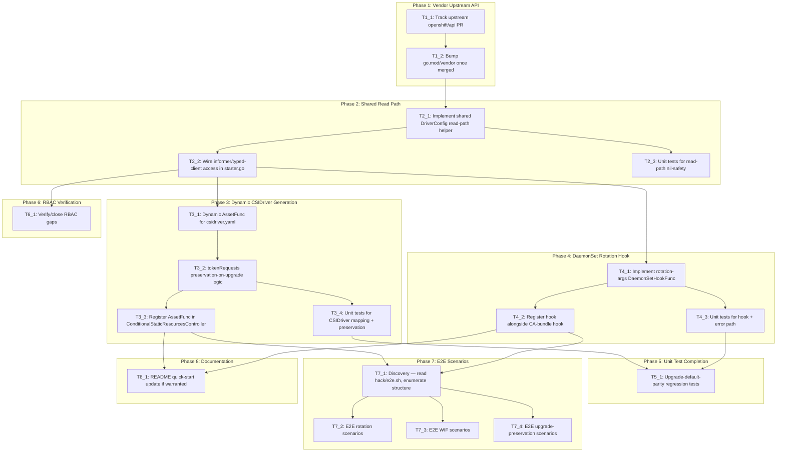

# Execution Backlog
**Feature:** Configurable Secret Rotation and Workload Identity Federation for the Secrets Store CSI Driver
**AgentRoutingMode:** PROVIDED (per `constitution.md` header `<!-- AgentRoutingMode: PROVIDED -->`)
**ConstitutionVersion:** 1.0.0 (Ratified 2026-07-02, Last Amended 2026-07-02)

> **Agent routing note** (carried forward from `plan.md` §0/§8 Open Question 3): `constitution.md` declares `AgentRoutingMode: PROVIDED`, but the root `AGENTS.md` it pairs with contains no formal Agent-ID capability table. Per `plan.md`'s explicit substitution, this backlog routes tasks using the Constitution's own **Code Ownership** table (`ControllerLogic`, `StaticAssets`, `OLMRelease`, `Testing`, `Docs`, each `_Agent`-suffixed for consistency with the provisional-ID convention) rather than either inventing a different taxonomy or silently falling back to `PROVISIONAL`. One task (`T1_1`) has no in-repo agent — it tracks an external, cross-repository dependency.

## 0. Input coverage checklist

**Functional Requirements (`specs.md`)**:
- FR-001 (enable/disable rotation) → `T4_1`, `T4_2`, `T4_3`, `T7_2`
- FR-002 (configurable rotation interval) → `T4_1`, `T4_2`, `T4_3`, `T7_2`
- FR-003 (configure token audiences for WIF) → `T3_1`, `T3_2`, `T3_3`, `T3_4`, `T7_3`
- FR-004 (multiple simultaneous distinct audiences) → `T3_1`, `T3_4`, `T7_3`
- FR-005 (reject out-of-range values) → enforced upstream via CEL in `openshift/api` (this repo has no validation-allowlist code, per `repo-assessment.md` §4.1/`plan.md` §3.1) → `T1_2` (must confirm the vendored bump includes these CEL rules)
- FR-006 (preserve pre-existing externally-configured audiences until opt-in) → `T3_2`, `T3_4`, `T7_4`
- FR-007 (one-way transition to Managed, no revert) → enforced upstream via CEL (`T1_2`); this repo has no enforcement code for it
- FR-008 (clear managed audiences via empty list) → `T3_1`, `T3_2`, `T3_4`, `T7_3`
- FR-009 (apply changes without manual driver restart) → structural property of `T3_3`/`T4_2`'s reconciliation wiring — no dedicated task, verified via `T7_2`/`T7_3`
- FR-010 (no `driverConfig` ⇒ identical to prior hardcoded default) → `T2_1` (defaults baked into the helper), `T5_1` (explicit regression tests), `T7_4`
- FR-011 (≥2 simultaneous audiences, independent validity durations) → `T3_1`, `T3_4`, `T7_3`

**Success Criteria (`specs.md`)**: SC-001/SC-002 (rotation behavior) → `T7_2` + manual verification in `T4_3`; SC-003/SC-004 (WIF auth + multi-audience) → `T7_3`; SC-005 (disruption-free upgrade) → `T7_4`; SC-006 (invalid config rejected pre-apply) → `T1_2` (upstream CEL); SC-007 (clearing audiences) → `T7_3`.

**Plan phases (`plan.md` §5)** → Task IDs:
- Phase 1 (Vendor Upstream API) → `T1_1`, `T1_2`
- Phase 2 (Shared Read Path) → `T2_1`, `T2_2`, `T2_3`
- Phase 3 (Dynamic `CSIDriver` Generation) → `T3_1`, `T3_2`, `T3_3`, `T3_4`
- Phase 4 (DaemonSet Rotation Hook) → `T4_1`, `T4_2`, `T4_3`
- Phase 5 (Unit Test Completion Pass) → `T5_1`
- Phase 6 (RBAC Verification) → `T6_1`
- Phase 7 (E2E Test Scenarios) → `T7_1`, `T7_2`, `T7_3`, `T7_4`
- Phase 8 (Documentation) → `T8_1`

No spec FR, SC, or plan phase is uncovered.

## 1. Task Dependency Graph (Mermaid)

## 2. Linear Execution Order (Chronological)

1. [x] `T1_1` — Track upstream `openshift/api` PR status for `SecretsStore`
2. [x] `T1_2` — Bump `go.mod`/`go.sum`/`vendor/` once the upstream PR merges
3. [x] `T2_1` — Implement shared `ClusterCSIDriver.Spec.DriverConfig` read-path helper
4. [x] `T2_2` — Wire the new informer/typed-client access into `starter.go`
5. [x] `T2_3` — Unit tests for the read-path helper's nil-safety branches
6. [x] `T3_1` — Implement dynamic `AssetFunc` for `csidriver.yaml`
7. [x] `T4_1` — Implement the rotation-args `DaemonSetHookFunc`
8. [x] `T3_2` — Implement `tokenRequests` preservation-on-upgrade logic
9. [x] `T4_2` — Register the new hook alongside the existing CA-bundle hook
10. [x] `T3_3` — Register the new `AssetFunc` in `WithConditionalStaticResourcesController`
11. [x] `T4_3` — Unit tests for the DaemonSet hook + container-not-found error path
12. [x] `T3_4` — Unit tests for `CSIDriver` field mapping + preservation cascade
13. [x] `T6_1` — Verify/close RBAC gaps against the finalized read-path mechanism
14. [x] `T5_1` — Upgrade-default-parity regression tests (no-`driverConfig` / nil-`SecretsStore` paths)
15. [x] `T7_1` — Discovery: read `hack/e2e.sh` in full, enumerate existing e2e structure
16. [x] `T7_2` — E2E rotation scenarios (enable/disable/custom-interval)
17. [x] `T7_3` — E2E WIF scenarios (single/multi-audience)
18. [x] `T7_4` — E2E upgrade-preservation + no-`driverConfig` default-parity scenarios
19. [x] `T8_1` — Update `README.md` quick-start example, if warranted

*(T3_1/T4_1 and their respective sub-chains are parallelizable once T2_2 completes — see §3 `Parallel OK` column and §5.)*

## 3. Task Execution Manifest

| Task ID | Task Title | Assigned Agent | Phase | Depends On | Parallel OK | Complexity | Risk |
|---------|-----------|---------------|-------|-----------|------------|-----------|------|
| T1_1 | Track upstream `openshift/api` PR for `SecretsStore` | N/A (external — API approvers, no in-repo agent) | Phase 1 | none | No | 1 | High |
| T1_2 | Bump `go.mod`/`go.sum`/`vendor/` once merged | ControllerLogic_Agent | Phase 1 | T1_1 | No | 2 | High |
| T2_1 | Implement shared `DriverConfig` read-path helper | ControllerLogic_Agent | Phase 2 | T1_2 | No | 5 | Med |
| T2_2 | Wire informer/typed-client access in `starter.go` | ControllerLogic_Agent | Phase 2 | T2_1 | No | 3 | Med |
| T2_3 | Unit tests: read-path nil-safety branches | Testing_Agent | Phase 2 | T2_1 | Yes (with T2_2) | 3 | Low |
| T3_1 | Dynamic `AssetFunc` for `csidriver.yaml` | ControllerLogic_Agent | Phase 3 | T2_2 | Yes (with T4_1) | 5 | Med |
| T3_2 | `tokenRequests` preservation-on-upgrade logic | ControllerLogic_Agent | Phase 3 | T3_1 | No | 5 | High |
| T3_3 | Register `AssetFunc` in `WithConditionalStaticResourcesController` | ControllerLogic_Agent | Phase 3 | T3_2 | No | 2 | Med |
| T3_4 | Unit tests: `CSIDriver` mapping + preservation cascade | Testing_Agent | Phase 3 | T3_2 | Yes (with T3_3) | 5 | Med |
| T4_1 | Implement rotation-args `DaemonSetHookFunc` | ControllerLogic_Agent | Phase 4 | T2_2 | Yes (with T3_1) | 3 | Med |
| T4_2 | Register hook alongside existing CA-bundle hook | ControllerLogic_Agent | Phase 4 | T4_1 | No | 1 | Low |
| T4_3 | Unit tests: hook arg replacement + error path | Testing_Agent | Phase 4 | T4_1 | Yes (with T4_2) | 2 | Low |
| T5_1 | Upgrade-default-parity regression tests | Testing_Agent | Phase 5 | T3_4, T4_3 | No | 3 | High |
| T6_1 | Verify/close RBAC gaps against final mechanism | StaticAssets_Agent | Phase 6 | T2_2 | Yes (with Phase 3/4) | 2 | Low |
| T7_1 | Discovery: enumerate `hack/e2e.sh` structure | Testing_Agent | Phase 7 | T3_3, T4_2 | No | 1 | Low |
| T7_2 | E2E: rotation enable/disable/custom-interval | Testing_Agent | Phase 7 | T7_1 | Yes (with T7_3, T7_4) | 5 | Med |
| T7_3 | E2E: WIF single/multi-audience | Testing_Agent | Phase 7 | T7_1 | Yes (with T7_2, T7_4) | 5 | Med |
| T7_4 | E2E: upgrade-preservation + default-parity | Testing_Agent | Phase 7 | T7_1 | Yes (with T7_2, T7_3) | 5 | High |
| T8_1 | README quick-start update, if warranted | Docs_Agent | Phase 8 | T3_3, T4_2 | Yes (with Phase 5–7) | 1 | Low |

## 4. Task Specifications (Payloads)

### Task T1_1: Track upstream `openshift/api` PR for `SecretsStore`

- **Objective:** Confirm (or initiate) the `github.com/openshift/api` change adding `SecretsStoreDriverType` and `SecretsStoreCSIDriverConfigSpec` to `CSIDriverConfigSpec`, and obtain a realistic merge/tag timeline.
- **Target file(s):** None in this repo — this task operates entirely against the external `openshift/api` repository/PR process.
- **Non-goals / forbidden edits:** Do not hand-edit anything under `vendor/github.com/openshift/api/` (Constitution Principle X: never modify `vendor/` directly).
- **Implementation notes:** Per `plan.md` §4/§8 Open Question 1, this is the single hard blocker for the entire feature. Confirm with API approvers (`@JoelSpeed` per the EP frontmatter) whether a PR already exists; if not, this task includes drafting/filing one following the API type's existing discriminated-union pattern (`AWSCSIDriverConfigSpec` et al., `repo-assessment.md` §3.2). Evaluate whether a temporary `go.mod` `replace` directive against a fork/branch is acceptable for unblocking Phase 2–5 *development-time iteration only* — never for merge.
- **Acceptance criteria:** A known PR reference (or filed PR) exists with a stated target merge/tag; OR an explicit decision to proceed with a `replace`-directive-based development fork is documented and communicated to reviewers. Traces to `plan.md` §4 hard blocker and §8 Open Question 1.
- **Downstream handoff:** The confirmed upstream commit/tag (or fork SHA) that `T1_2` will vendor.

### Task T1_2: Bump `go.mod`/`go.sum`/`vendor/` once merged

- **Objective:** Consume the new `SecretsStore` API types in this repo's dependency graph.
- **Target file(s):** `go.mod`, `go.sum`, `vendor/modules.txt`, `vendor/github.com/openshift/api/operator/v1/types_csi_cluster_driver.go` (regenerated, never hand-edited).
- **Non-goals / forbidden edits:** Do not hand-edit any file under `vendor/` (Constitution Principle X). Do not add a permanent `replace` directive.
- **Implementation notes:** `go get github.com/openshift/api@<new-sha-or-tag>` then `go mod vendor`. Confirm the vendored `CSIDriverType` enum now includes `SecretsStore` and `CSIDriverConfigSpec` has the new field, matching the discriminated-union shape assumed by `plan.md` §3.1.
- **Acceptance criteria:** `go mod tidy && go mod vendor && make verify` passes cleanly; the new types are visible and compile against in `vendor/github.com/openshift/api/operator/v1/types_csi_cluster_driver.go`. Traces to `plan.md` Phase 1, FR-005/FR-007 (upstream CEL enforcement now present).
- **Downstream handoff:** A vendored tree with the new Go types available for `T2_1` to import.

### Task T2_1: Implement shared `DriverConfig` read-path helper

- **Objective:** Build the single shared component that reads `ClusterCSIDriver.Spec.DriverConfig.SecretsStore` with full nil-safety across every level (per the source EP's 5-level cascade) and resolves rotation/token-audience values with defaults matching today's hardcoded behavior.
- **Target file(s):** New file under `pkg/operator/` — exact name UNVERIFIED at planning time (`repo-assessment.md` §11.1/`plan.md` §5 Phase 2 flag this as a discovery item); suggested `pkg/operator/secretsstoreconfig.go` pending confirmation there's no better-fitting existing location.
- **Non-goals / forbidden edits:** Do not implement CSIDriver mutation or DaemonSet mutation logic here — this task is the read/resolve layer only, consumed by `T3_1`/`T3_2` and `T4_1` (Constitution Principle I: express new capability via existing extension points, not a new reconciler).
- **Implementation notes:** Must handle: `driverConfig` absent, `driverType != SecretsStore`, `secretsStore` nil, `secretRotation`/`tokenRequests` nil — each falling back to built-in defaults (rotation enabled, 2-minute interval, no managed audiences) exactly matching today's hardcoded `assets/node.yaml` values (FR-010). This is the one component both `T3_1`/`T3_2` and `T4_1` must reuse — do not duplicate this logic in either consumer (`plan.md` §3.2/§11 mitigation).
- **Acceptance criteria:** Traces to `specs.md` FR-001–FR-004, FR-006, FR-008, FR-010, FR-011 and all Edge Cases. Verified by `T2_3`'s unit tests, not by this task directly.
- **Downstream handoff:** A stable Go function/type signature that `T2_2` wires up and `T3_1`/`T3_2`/`T4_1` call.

### Task T2_2: Wire informer/typed-client access in `starter.go`

- **Objective:** Instantiate and start whatever informer/lister or typed-client access `T2_1`'s helper needs, inside `RunOperator`.
- **Target file(s):** `pkg/operator/starter.go` (specifically the informer-construction block, lines 40-71, and the informer-start block, lines 118-121).
- **Non-goals / forbidden edits:** Do not remove or alter the existing generic operator client (`goc.NewClusterScopedOperatorClientWithConfigName`) — it remains the source for `OperatorSpec`/`OperatorStatus`; this task adds a new, additional access path, it does not replace the existing one.
- **Implementation notes:** Per `plan.md` §8 Open Question 2, default to a dedicated typed informer/lister (e.g. via `github.com/openshift/client-go/operator/informers/externalversions`, already transitively vendored) for consistency with this operator's existing fully-informer-driven design — but this is a recommendation, not a proven-in-repo pattern (`repo-assessment.md` §11.1). If a prototype shows a direct typed-client `Get` call is simpler and sufficient, that is an acceptable deviation — document the choice in the task's completion notes.
- **Acceptance criteria:** The new informer (if chosen) is started alongside the existing three (`kubeInformersForNamespaces`, `dynamicInformers`, `configInformers`) in the `go ...Start(ctx.Done())` block. `make verify && make test-unit` passes. Traces to `plan.md` §3.2/§4.2 gap closure.
- **Downstream handoff:** A working, started read path that `T3_1`, `T3_2`, and `T4_1` can call without additional wiring.

### Task T2_3: Unit tests — read-path nil-safety branches

- **Objective:** Cover every nil-safety branch in `T2_1`'s helper with table-driven tests.
- **Target file(s):** New `_test.go` file co-located with `T2_1`'s new file, following the `pkg/operator/starter_test.go` pattern (`FakeOperator` struct + `v1helpers.NewFakeOperatorClientWithObjectMeta`).
- **Non-goals / forbidden edits:** No third-party assertion/mocking libraries (`docs/testing-guidelines.md`/Constitution Principle V evidence).
- **Implementation notes:** Cases: `driverConfig` absent; `driverType != SecretsStore`; `secretsStore` nil; `secretRotation` nil; `tokenRequests` nil; fully-populated happy path; each asserting the resolved defaults/values via `t.Fatalf`/`t.Errorf` per existing style.
- **Acceptance criteria:** `make test-unit` passes; every branch in `T2_1` has at least one covering case. Traces to `specs.md` Edge Cases and FR-010.
- **Downstream handoff:** Confidence for `T3_1`/`T3_2`/`T4_1` to build on a verified helper.

### Task T3_1: Dynamic `AssetFunc` for `csidriver.yaml`

- **Objective:** Replace the byte-level-only application of `assets/csidriver.yaml` with a dynamic `AssetFunc` that additionally sets `spec.requiresRepublish` and `spec.tokenRequests` based on `T2_1`'s resolved config.
- **Target file(s):** `assets/csidriver.yaml` (becomes a base template, content otherwise unchanged); new or extended file in `pkg/operator/` implementing the wrapper `AssetFunc`.
- **Non-goals / forbidden edits:** Do not touch `podInfoOnMount`/`attachRequired`/`fsGroupPolicy`/`volumeLifecycleModes` — these remain static and unrelated to this feature.
- **Implementation notes:** Follow the existing `replaceNamespaceFunc` closure shape (`func(name string) ([]byte, error)`, `starter.go:131-139`) but additionally decode the YAML, call `T2_1`'s helper, set fields, and re-serialize. `requiresRepublish` mirrors `secretRotation.type` (`false` only when explicitly `"None"`, per the source EP's resolved Open Question 1 — carried into `specs.md` Edge Cases).
- **Acceptance criteria:** Traces to `specs.md` FR-003, FR-004, FR-011. Verified by `T3_4`.
- **Downstream handoff:** A working `AssetFunc` that `T3_2` extends with preservation logic and `T3_3` registers.

### Task T3_2: `tokenRequests` preservation-on-upgrade logic

- **Objective:** Extend `T3_1`'s `AssetFunc` to read the **live** `CSIDriver` object's existing `spec.tokenRequests` and preserve it whenever the resolved config is `Unmanaged`/omitted, implementing the full 5-level nil-check cascade the source EP describes.
- **Target file(s):** Same file(s) as `T3_1`.
- **Non-goals / forbidden edits:** Do not implement this preservation logic anywhere outside the `AssetFunc` (e.g. not in `T2_1`'s general-purpose helper) — it is specific to the `CSIDriver`-mutation consumer, per `plan.md` §2.
- **Implementation notes:** Cascade order (from the source EP, carried via `specs.md` FR-006/FR-008): `driverType != SecretsStore` → return existing; `secretsStore` nil → return existing; `tokenRequests` nil or `type: Unmanaged` → return existing; `type: Managed` with `managed.audiences` → use the audiences list (empty list clears). This is entirely new code with no precedent elsewhere in this repo (`repo-assessment.md` §11 risk) — treat as its own well-tested unit, not folded into `T3_1`'s general mapping.
- **Acceptance criteria:** Traces to `specs.md` FR-006, FR-008, User Story 3 acceptance scenarios. Verified by `T3_4`.
- **Downstream handoff:** A complete, preservation-aware `AssetFunc` ready for registration in `T3_3`.

### Task T3_3: Register `AssetFunc` in `WithConditionalStaticResourcesController`

- **Objective:** Swap the current generic `AssetFunc` reference for `csidriver.yaml` with the new dynamic one from `T3_1`/`T3_2`, in the existing controller-set wiring.
- **Target file(s):** `pkg/operator/starter.go:79-100` (`WithConditionalStaticResourcesController` call).
- **Non-goals / forbidden edits:** Do not alter the other 7 files in that call's file list (`node_sa.yaml`, `cabundle_cm.yaml`, RBAC/network-policy assets) — they remain on the existing generic `replaceNamespaceFunc`.
- **Implementation notes:** Per-file `AssetFunc` override may require restructuring this call slightly if the current `WithConditionalStaticResourcesController` signature applies one `AssetFunc` to the whole file list — verify the library-go signature (`repo-assessment.md` §3.2 cites the exact vendored signature) and adapt accordingly (e.g. a dispatcher `AssetFunc` that special-cases `csidriver.yaml`).
- **Acceptance criteria:** `make verify && make test-unit` passes; manual verification per `repo-assessment.md` §12: `oc get csidriver secrets-store.csi.k8s.io -o yaml` reflects config changes. Traces to `plan.md` Phase 3.
- **Downstream handoff:** Feature-complete `CSIDriver` reconciliation ready for `T7_3`/`T7_4` e2e coverage.

### Task T3_4: Unit tests — `CSIDriver` mapping + preservation cascade

- **Objective:** Table-driven coverage of `T3_1`/`T3_2`'s field mapping and all 5 preservation nil-check levels.
- **Target file(s):** New `_test.go` co-located with `T3_1`/`T3_2`'s file(s).
- **Non-goals / forbidden edits:** No third-party assertion libraries.
- **Implementation notes:** Cases per the source EP's own Unit Test Plan (carried as authoritative implementation-level detail per `plan.md` §1/`repo-assessment.md` recommendation): each nil-check level with/without existing live `tokenRequests`; `Managed` with populated audiences; `Managed` with empty audiences (clear); `requiresRepublish` mirroring `secretRotation.type`.
- **Acceptance criteria:** `make test-unit` passes; traces to `specs.md` FR-003/004/006/008/011 and Edge Cases.
- **Downstream handoff:** Verified confidence for `T5_1`'s cross-cutting regression pass and `T7_3`/`T7_4` e2e scenarios.

### Task T4_1: Implement rotation-args `DaemonSetHookFunc`

- **Objective:** Implement a new `DaemonSetHookFunc` that sets `--enable-secret-rotation=`/`--rotation-poll-interval=` on the `csi-driver` container based on `T2_1`'s resolved rotation config.
- **Target file(s):** New file under `pkg/operator/`, structurally following `csidrivernodeservicecontroller.WithCABundleDaemonSetHook` (`repo-assessment.md` §5, vendored at `vendor/.../csidrivernodeservicecontroller/helpers.go:32-75`).
- **Non-goals / forbidden edits:** Do not modify the existing `WithCABundleDaemonSetHook` registration or `assets/cabundle_cm.yaml` — this is a purely additive hook.
- **Implementation notes:** Find/replace args by `--flag=` prefix match on the `csi-driver` container (mirrors the source EP's described mechanism); when config is unset, preserve the existing hardcoded defaults (`true`, `2m`) baked into `assets/node.yaml:45-46` today (FR-010, upgrade safety).
- **Acceptance criteria:** Traces to `specs.md` FR-001, FR-002. Verified by `T4_3`.
- **Downstream handoff:** A working hook function ready for registration in `T4_2`.

### Task T4_2: Register hook alongside existing CA-bundle hook

- **Objective:** Add `T4_1`'s hook as an additional variadic argument to `WithCSIDriverNodeService(...)`.
- **Target file(s):** `pkg/operator/starter.go:104-116`.
- **Non-goals / forbidden edits:** Must not remove or reorder the existing `csidrivernodeservicecontroller.WithCABundleDaemonSetHook(...)` argument (Constitution Principle VIII: CA bundle propagation is mandatory and must be preserved on any DaemonSet configuration change).
- **Implementation notes:** Simple additive change — append the new hook to the existing call's variadic hook list.
- **Acceptance criteria:** `make verify && make test-unit` passes; manual verification per `repo-assessment.md` §12: `oc get ds -n openshift-cluster-csi-drivers secrets-store-csi-driver-node -o jsonpath='{...args}'` reflects config changes, and the CA-bundle injection continues to function. Traces to `plan.md` Phase 4.
- **Downstream handoff:** Feature-complete DaemonSet reconciliation ready for `T7_2` e2e coverage.

### Task T4_3: Unit tests — hook arg replacement + error path

- **Objective:** Table-driven coverage of `T4_1`'s arg-replacement logic and its "csi-driver container not found" error path.
- **Target file(s):** New `_test.go` co-located with `T4_1`'s file.
- **Non-goals / forbidden edits:** No third-party assertion libraries.
- **Implementation notes:** Cases: default (no config) preserves `true`/`2m`; custom interval sets `--rotation-poll-interval=<value>`; `secretRotation.type: "None"` sets `--enable-secret-rotation=false`; container-not-found returns a non-nil error (per the source EP's Unit Test Plan).
- **Acceptance criteria:** `make test-unit` passes; traces to `specs.md` FR-001/FR-002 and Edge Cases.
- **Downstream handoff:** Verified confidence for `T5_1` and `T7_2`.

### Task T5_1: Upgrade-default-parity regression tests

- **Objective:** Explicitly table-test the "no `driverConfig`" and "`driverConfig` present but `SecretsStore` nil" paths across **both** consumers (`T3_1`/`T3_2` and `T4_1`) as first-class cases, closing `plan.md` §7's identified regression risk.
- **Target file(s):** Extends the `_test.go` files from `T2_3`/`T3_4`/`T4_3` — no new files anticipated, but a new file is acceptable if a cross-cutting regression suite is clearer.
- **Non-goals / forbidden edits:** This is a verification-only task — no production code changes.
- **Implementation notes:** Assert that with no `driverConfig` set, the resulting `CSIDriver` object and `DaemonSet` args are byte-for-byte/value-for-value identical to what today's static manifests produce (FR-010) — this is the single highest-value regression check per `plan.md` §7.
- **Acceptance criteria:** `make test-unit` passes; traces to `specs.md` FR-010 and `plan.md` §7 risk mitigation.
- **Downstream handoff:** Confidence gate before `T7_4`'s e2e upgrade-preservation scenarios.

### Task T6_1: Verify/close RBAC gaps against final mechanism

- **Objective:** Confirm the RBAC verbs already granted for `clustercsidrivers`/`clustercsidrivers/status`/`csidrivers` (per `repo-assessment.md` §6/§7) are sufficient for whatever mechanism `T2_2` finalized; add the minimal necessary verb in both places if a gap is found.
- **Target file(s):** `assets/rbac/*.yaml` and `config/manifests/stable/secrets-store-csi-driver-operator.clusterserviceversion.yaml` (only if a gap is found — these are two independent sources of truth, `repo-assessment.md` §7).
- **Non-goals / forbidden edits:** Do not grant RBAC inline/dynamically at runtime (Constitution Principle VI) — any new verb must be an explicit YAML change in `assets/rbac/`, mirrored in the CSV.
- **Implementation notes:** Expected outcome, per `plan.md` §3.4, is **no change** — this task is primarily a verification step. Only proceed to an actual RBAC edit if `T2_2`'s chosen mechanism genuinely requires a verb not already granted.
- **Acceptance criteria:** Documented confirmation that the finalized mechanism's calls are covered by existing RBAC, OR a matching pair of edits (asset + CSV) if not. Traces to `plan.md` §3.4/§6.
- **Downstream handoff:** RBAC posture confirmed before PR submission.

### Task T7_1: Discovery — enumerate `hack/e2e.sh` structure

- **Objective:** Read `hack/e2e.sh` in full and enumerate the actual e2e test file organization, closing the `repo-assessment.md` §11.1 UNVERIFIED item before scoping `T7_2`–`T7_4`.
- **Target file(s):** `hack/e2e.sh` (read-only for this task).
- **Non-goals / forbidden edits:** No test code written in this task — discovery only.
- **Implementation notes:** Determine where new e2e test scenarios should physically live (new Go test file(s), new script section, or existing suite extension) before `T7_2`–`T7_4` begin.
- **Acceptance criteria:** A short discovery note (where new e2e scenarios will be added) is available to unblock `T7_2`–`T7_4`. Traces to `plan.md` Phase 7 discovery step.
- **Downstream handoff:** Confirmed e2e scaffolding location for the three e2e task payloads below.

### Task T7_2: E2E — rotation enable/disable/custom-interval

- **Objective:** Implement the source EP's e2e rotation scenarios: no-`driverConfig` defaults; custom interval; `"None"` disables; toggle back to `"Custom"`.
- **Target file(s):** Per `T7_1`'s discovery output.
- **Non-goals / forbidden edits:** Do not modify WIF-related scenarios (owned by `T7_3`).
- **Implementation notes:** Verify via `oc get csidriver .../oc get ds ...` commands per `repo-assessment.md` §12 and the source EP's own Test Plan scenarios.
- **Acceptance criteria:** `make test-e2e` (requires live cluster) passes these scenarios; traces to `specs.md` SC-001/SC-002, User Story 1.
- **Downstream handoff:** Rotation behavior e2e-verified.

### Task T7_3: E2E — WIF single/multi-audience

- **Objective:** Implement the source EP's e2e WIF scenarios: single audience; multiple audiences (AWS + Azure); custom `expirationSeconds`; clearing via empty list; Unmanaged→Managed transition.
- **Target file(s):** Per `T7_1`'s discovery output.
- **Non-goals / forbidden edits:** Do not modify rotation-only scenarios (owned by `T7_2`).
- **Implementation notes:** Mirrors the source EP's "tokenRequests migration scenarios" and "Multi-cloud WIF scenarios" Test Plan sections.
- **Acceptance criteria:** `make test-e2e` passes these scenarios; traces to `specs.md` SC-003/SC-004/SC-007, User Story 2.
- **Downstream handoff:** WIF behavior e2e-verified.

### Task T7_4: E2E — upgrade-preservation + default-parity

- **Objective:** Implement the source EP's e2e upgrade scenarios: minimal CR with no existing tokenRequests; minimal CR with pre-existing manually-patched Azure WIF audiences (verify preservation, no spec-hash change, no delete+recreate); DaemonSet args unchanged; post-upgrade opt-in.
- **Target file(s):** Per `T7_1`'s discovery output.
- **Non-goals / forbidden edits:** None beyond staying within upgrade-scenario scope.
- **Implementation notes:** This is the highest-risk e2e set per `plan.md` §7 — pay particular attention to confirming the `CSIDriver` object's spec-hash does **not** change (i.e. no unnecessary delete+recreate) when nothing should have changed.
- **Acceptance criteria:** `make test-e2e` passes these scenarios; traces to `specs.md` SC-005, User Story 3, FR-010.
- **Downstream handoff:** Upgrade-safety behavior e2e-verified — this closes the feature's highest-priority risk.

### Task T8_1: README quick-start update, if warranted

- **Objective:** Update `README.md`'s quick-start `ClusterCSIDriver` example if the new `driverConfig.secretsStore` fields warrant a documentation mention.
- **Target file(s):** `README.md`.
- **Non-goals / forbidden edits:** Do not touch `docs/*-guidelines.md` (contributor conventions, not user docs — not expected to need changes since this feature follows existing conventions exactly, per `plan.md` §1).
- **Implementation notes:** Optional/judgment call — if the maintainers decide the quick-start example doesn't need the new fields shown, this task can close as "no change needed" with a one-line rationale.
- **Acceptance criteria:** Either an updated `README.md` example, or a documented decision that no update is needed.
- **Downstream handoff:** N/A — terminal task.

## 5. Orchestration notes (non-code)

### Retry Boundaries

- `T1_2` (vendor bump) is safely retryable — `go mod vendor` is idempotent; re-run if the first attempt fails due to network/registry issues.
- `T2_1`–`T4_3` (Go implementation + unit tests) are safely retryable per task — each is scoped to new files or additive changes, so a failed attempt can be redone without affecting sibling tasks, provided `T3_3`/`T4_2` (the two *registration* tasks) are not retried concurrently with each other on the same `starter.go` (see Merge Conflict Hotspots below).
- `T7_2`–`T7_4` (e2e) are **not** cheaply retryable — they require a live cluster and take real wall-clock time; batch reruns rather than retrying individual assertions where possible.
- `T1_1` (external tracking) has no meaningful "retry" — it's a state-check/communication task, re-run only to refresh status.

### Merge Conflict Hotspots

- **`pkg/operator/starter.go`** is the single highest-contention file — `T2_2`, `T3_3`, `T4_2`, and `T6_1` (if RBAC wiring changes are needed) all touch it. Sequence these serially per the DAG (§1) rather than attempting true concurrent edits; if parallel work is unavoidable, rebase frequently and keep each task's diff to its specific call/block (informer-start block vs. `WithConditionalStaticResourcesController` call vs. `WithCSIDriverNodeService` call) to minimize line-level overlap.
- **`vendor/`** — never hand-edited (Constitution Principle X); `T1_2` is the only task that touches it, via `go mod vendor` regeneration, so no merge-conflict risk from concurrent hand-edits, but rebasing any other task's branch onto a fresh `T1_2` vendor bump may require a `go mod vendor` re-run to pick up lockfile changes.
- **`config/manifests/stable/secrets-store-csi-driver-operator.clusterserviceversion.yaml`** — only touched by `T6_1`, and only if a genuine RBAC gap is found; low contention risk, but remember this file and `assets/rbac/*.yaml` are two independent sources of truth (`repo-assessment.md` §7) that must be updated together in the same task/PR, never separately.
- No `bindata`/`zz_generated.*` files exist in this repo (`repo-assessment.md` §6 "Code Generation" guardrail confirms no code generation here) — this class of hotspot does not apply.

### Open Questions Requiring SME Before Execution

- **Upstream `openshift/api` PR status/timeline** (blocks `T1_1` → everything downstream): owner is the API approvers (`@JoelSpeed` per the EP frontmatter), not this repo's contributors. Until resolved, `T2_1`–`T4_3` can proceed as design/coding work behind a temporary `go.mod replace` (never merged), but `T1_2` and everything after it cannot be considered "done" until the real upstream dependency lands.
- **Read-path mechanism choice — informer/lister vs. typed `Get`** (blocks finalizing `T2_2`, and by extension the "final mechanism" `T6_1` verifies against): owner is the implementing engineer / code reviewer. Default assumption per `plan.md` §8: a dedicated informer/lister, for consistency with this operator's existing fully-informer-driven design — but prototype before committing, since `repo-assessment.md` §11.1 confirms this pattern is not yet proven in this specific operator.
- **`AgentRoutingMode: PROVIDED` vs. missing formal Agent-ID table in `AGENTS.md`** (affects how strictly `Assigned Agent` values in §3 above should be enforced during `/opsx-apply`): owner is the repo maintainer / user. This backlog uses the Constitution's Code Ownership categories as a substitute concrete taxonomy (documented in the header note above); if the user wants strict formal Agent-ID matching, `AGENTS.md` should gain a real routing table before implementation begins — this does not block starting `T1_1`/`T1_2`, but should be resolved before task-by-task `/opsx-apply` execution if strict agent enforcement matters to the user.
- **README update judgment call** (blocks finalizing `T8_1` only): owner is the repo maintainer — a low-stakes, non-blocking decision that can be resolved at the time `T8_1` is picked up.
